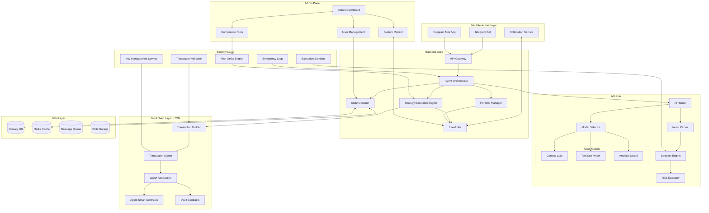
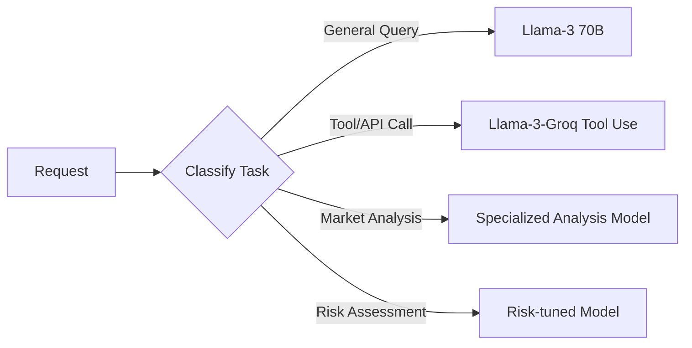
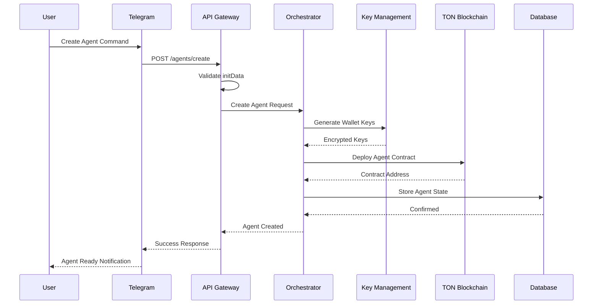
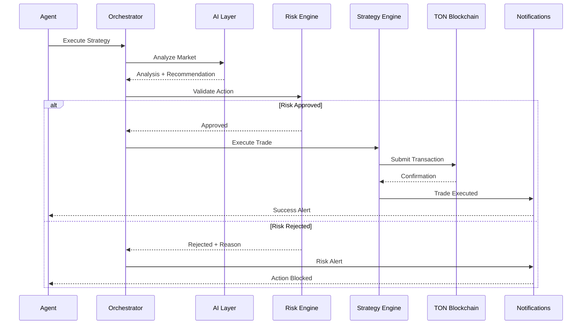
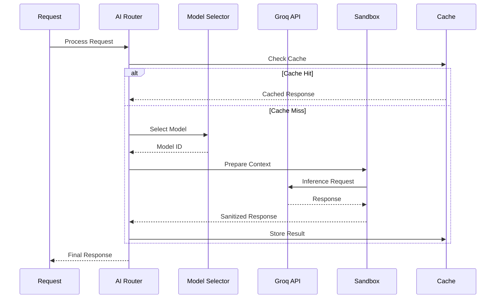
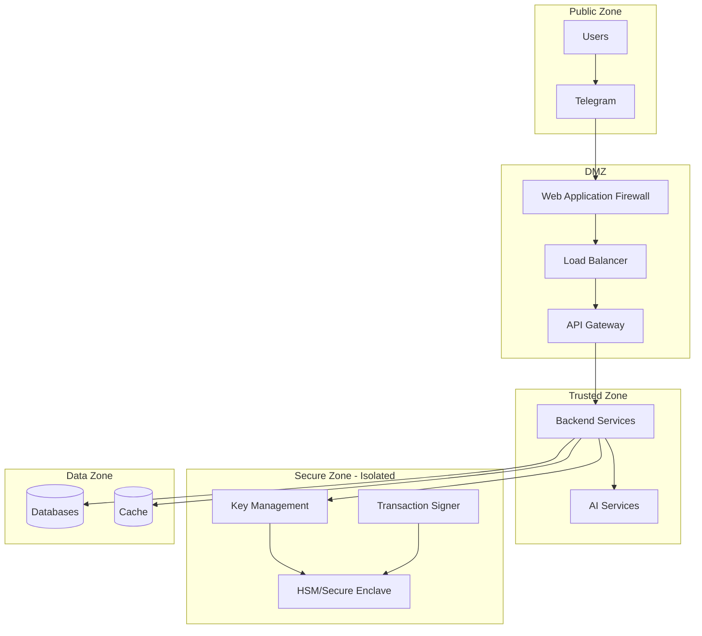
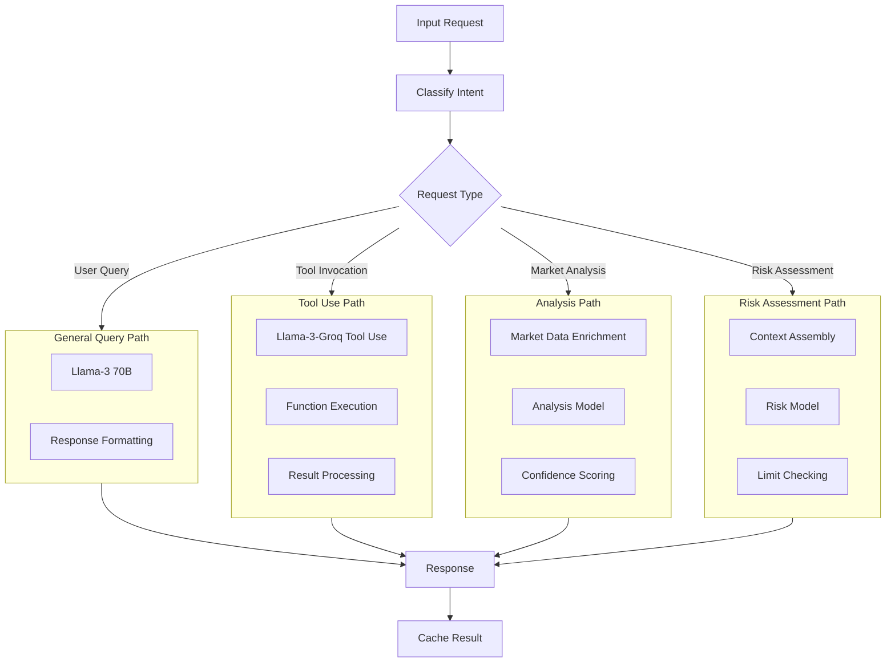
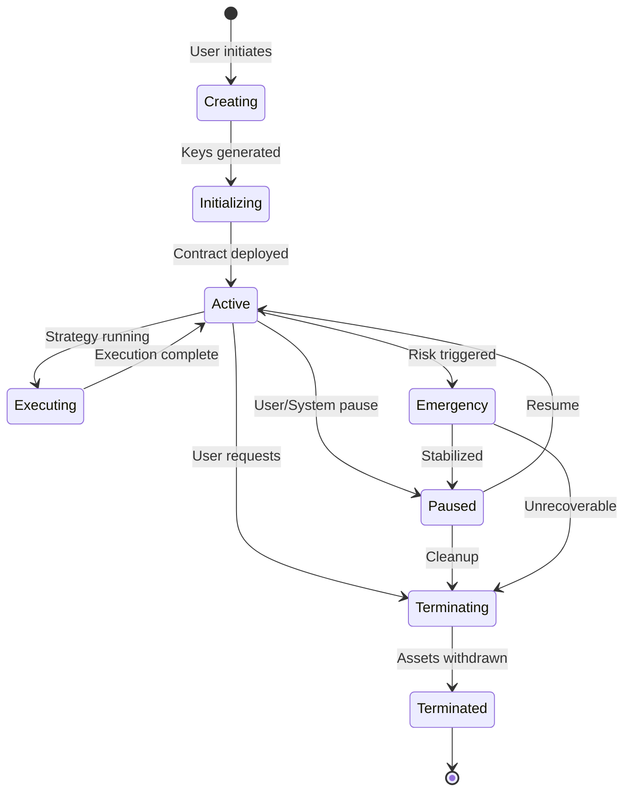
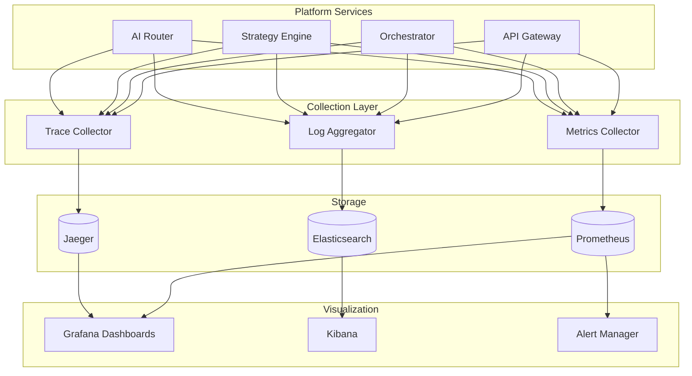
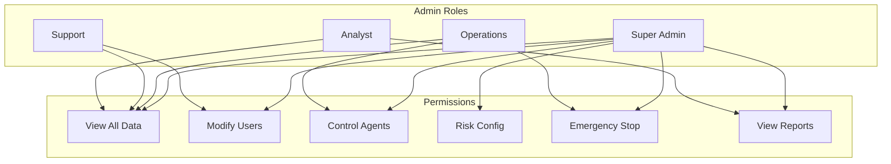

# TONAIAgent - High-Level System Architecture

## Overview

TONAIAgent is an autonomous AI agents platform built on TON blockchain, with AI powered by Groq and user interaction through Telegram (Bot + Mini App). This architecture enables autonomous financial agents, secure execution, AI-driven decision making, scalable DeFi automation, and modular extensible design.

The system is designed to support millions of users and agents operating 24/7.

---

## Table of Contents

1. [High-Level System Diagram](#high-level-system-diagram)
2. [Core Platform Components](#core-platform-components)
3. [Data Flow](#data-flow)
4. [Security Model](#security-model)
5. [AI Routing Architecture](#ai-routing-architecture)
6. [Agent Lifecycle Management](#agent-lifecycle-management)
7. [Observability and Monitoring](#observability-and-monitoring)
8. [Admin and Control Layer](#admin-and-control-layer)
9. [Technical Decisions and Trade-offs](#technical-decisions-and-trade-offs)

---

## High-Level System Diagram



---

## Core Platform Components

### 1. User Interaction Layer

The user-facing layer provides all touchpoints for user interaction.

| Component | Purpose | Technology |
|-----------|---------|------------|
| **Telegram Bot** | Primary interface for commands, agent management, and notifications | Node.js + grammy/telegraf |
| **Telegram Mini App** | Rich UI for portfolio viewing, strategy configuration, and analytics | React/Vue + Telegram WebApp SDK |
| **Notification Service** | Real-time alerts for trades, risks, and system events | WebSocket + Push notifications |

**Key Characteristics:**
- Zero signup friction (leverages Telegram authentication)
- Session-driven interfaces with ephemeral frontend state
- All business logic validated server-side
- Cryptographic validation of Telegram `initData`

### 2. Backend Core

The central orchestration layer managing agent operations and business logic.

| Component | Purpose | Technology |
|-----------|---------|------------|
| **API Gateway** | Request routing, rate limiting, authentication | Kong/Nginx + custom middleware |
| **Agent Orchestrator** | Coordinates agent lifecycle and operations | Node.js/Go microservice |
| **Strategy Execution Engine** | Executes trading strategies and DeFi operations | Go (high performance) |
| **Portfolio Manager** | Tracks holdings, P&L, and positions | Python (analytics) |
| **State Manager** | Maintains agent and user state | Node.js + Redis |
| **Event Bus** | Async communication between services | Apache Kafka / RabbitMQ |

**Design Principles:**
- Event-driven architecture for loose coupling
- Horizontal scalability via stateless services
- Idempotent operations with replay protection
- Circuit breakers for fault tolerance

### 3. AI Layer

The intelligence layer powered by Groq's ultra-fast inference.

| Component | Purpose | Technology |
|-----------|---------|------------|
| **AI Router** | Routes requests to appropriate models | Custom routing service |
| **Intent Parser** | Understands user commands and intents | Groq LLM |
| **Decision Engine** | Makes trading and strategic decisions | Groq LLM + custom logic |
| **Risk Evaluator** | Assesses risk of proposed actions | Groq LLM + rules engine |
| **Model Selector** | Dynamic model selection based on task | Rule-based + ML |

**Groq Model Routing Strategy:**



### 4. Blockchain Layer (TON)

The on-chain execution layer leveraging TON's high-performance infrastructure.

| Component | Purpose | Technology |
|-----------|---------|------------|
| **Wallet Abstraction** | Manages user wallets securely | TON SDK + custom abstraction |
| **Agent Smart Contracts** | On-chain agent logic and permissions | FunC/Tact |
| **Vault Contracts** | Secure asset custody | FunC/Tact |
| **Transaction Builder** | Constructs valid TON transactions | TON SDK |
| **Transaction Signer** | Signs transactions securely | Isolated signing service |

**TON Architecture Benefits:**
- Multi-chain architecture with dynamic sharding
- Millions of TPS scalability potential
- Low transaction fees
- Native Telegram integration

### 5. Security Layer

Defense-in-depth security protecting users, assets, and the platform.

| Component | Purpose | Technology |
|-----------|---------|------------|
| **Key Management Service** | Secure key storage and operations | HSM / MPC / Secure Enclave |
| **Risk Limits Engine** | Enforces per-agent and global limits | Rules engine |
| **Emergency Stop** | Circuit breaker for critical situations | Distributed consensus |
| **Transaction Validator** | Validates all transactions pre-signing | Custom validator |
| **Execution Sandbox** | Isolates AI model execution | Container isolation |

### 6. Data Layer

Persistent storage and caching infrastructure.

| Component | Purpose | Technology |
|-----------|---------|------------|
| **Primary Database** | Persistent state and history | PostgreSQL (sharded) |
| **Cache** | Fast state access and sessions | Redis Cluster |
| **Message Queue** | Async job processing | Kafka / RabbitMQ |
| **Blob Storage** | Large objects, logs, analytics | S3-compatible |

---

## Data Flow

### Agent Creation Flow



### Strategy Execution Flow



### AI Decision Flow



---

## Security Model

### Security Boundaries



### Security Principles

| Principle | Implementation |
|-----------|----------------|
| **AI Never Touches Keys** | Complete isolation between AI layer and key management |
| **Defense in Depth** | Multiple security layers with independent controls |
| **Least Privilege** | Minimal permissions per component |
| **Zero Trust** | All requests authenticated and authorized |
| **Secure by Default** | Conservative defaults, explicit opt-in for risky operations |

### Key Security Controls

1. **Authentication & Authorization**
   - Telegram cryptographic validation
   - JWT with short expiry
   - Role-based access control (RBAC)
   - Per-agent permission scopes

2. **Key Management**
   - MPC (Multi-Party Computation) for distributed key custody
   - HSM for high-security key operations
   - Key derivation for per-agent wallets
   - No plaintext keys in memory

3. **Risk Controls**
   - Per-transaction limits
   - Per-agent daily limits
   - Global platform limits
   - Velocity checks (unusual activity detection)
   - Whitelist-only destinations (optional)

4. **Emergency Response**
   - Global emergency stop
   - Per-agent pause capability
   - Automatic circuit breakers
   - Manual override by admins

---

## AI Routing Architecture

### Model Selection Strategy



### Cost Optimization

| Strategy | Description |
|----------|-------------|
| **Tiered Models** | Use smaller models for simple tasks, larger for complex |
| **Caching** | Cache common queries and analysis |
| **Batching** | Batch similar requests when latency allows |
| **Rate Limiting** | Per-user AI request limits |
| **Token Budgets** | Per-agent token consumption limits |

### Latency Optimization

- Groq's LPU provides sub-second inference (<0.13s first token)
- Connection pooling to Groq API
- Regional deployment for low-latency access
- Streaming responses for long outputs

---

## Agent Lifecycle Management

### Agent States



### Agent State Transitions

| From State | To State | Trigger | Actions |
|------------|----------|---------|---------|
| Creating | Initializing | Keys ready | Generate wallet, setup permissions |
| Initializing | Active | Contract deployed | Notify user, enable operations |
| Active | Paused | User/system request | Stop executions, hold assets |
| Active | Executing | Strategy triggered | Lock state, begin execution |
| Executing | Active | Execution complete | Update portfolio, log results |
| Active | Emergency | Risk breach | Halt all operations, alert user |
| Emergency | Paused | Admin review | Assess damage, plan recovery |
| Active | Terminating | User request | Initiate asset withdrawal |
| Terminating | Terminated | Assets cleared | Archive state, cleanup resources |

### Agent Configuration

```yaml
agent:
  id: "agent_xxx"
  owner: "telegram_user_id"
  created_at: "2026-01-15T10:30:00Z"

  wallet:
    address: "EQ..."
    type: "abstracted"

  permissions:
    max_trade_size: 1000  # TON
    daily_limit: 5000     # TON
    allowed_tokens: ["TON", "USDT", "SCALE"]
    allowed_protocols: ["dedust", "stonfi"]

  strategy:
    type: "dca"
    params:
      amount: 100
      frequency: "daily"
      token: "TON"

  risk_limits:
    max_slippage: 0.5     # percent
    stop_loss: 10         # percent
    max_gas_price: 1      # TON
```

---

## Observability and Monitoring

### Monitoring Architecture



### Key Metrics

| Category | Metrics |
|----------|---------|
| **Business** | Active agents, daily transactions, total volume, revenue |
| **Performance** | Latency (p50, p95, p99), throughput, error rates |
| **AI** | Model latency, token usage, cache hit rate, cost per request |
| **Blockchain** | Transaction success rate, gas usage, confirmation time |
| **Security** | Failed auth attempts, risk events, emergency stops |

### Alerting Rules

| Alert | Condition | Severity | Action |
|-------|-----------|----------|--------|
| High Error Rate | >5% errors in 5 min | Critical | Page on-call |
| AI Latency Spike | p99 > 2s | Warning | Investigate |
| Low Success Rate | Transaction success <95% | Critical | Check TON network |
| Risk Limit Breach | Any breach | Critical | Auto-pause agent |
| Unusual Activity | 3x normal volume | Warning | Review manually |

---

## Admin and Control Layer

### Admin Dashboard Features

| Feature | Description |
|---------|-------------|
| **System Overview** | Real-time platform health and metrics |
| **User Management** | View, suspend, or modify user accounts |
| **Agent Control** | Monitor and manage individual agents |
| **Risk Management** | Configure limits, review breaches |
| **Compliance** | Audit logs, reporting, KYC status |
| **Emergency Controls** | Global stop, agent pause, rate limiting |

### Access Control



---

## Technical Decisions and Trade-offs

### Decision 1: MPC vs HSM for Key Management

| Option | Pros | Cons | Decision |
|--------|------|------|----------|
| **MPC** | Distributed trust, no single point of failure | Complex implementation, latency | **Chosen for user wallets** |
| **HSM** | Proven security, fast operations | Single vendor dependency, cost | **Chosen for platform keys** |

**Rationale:** MPC provides better trust distribution for user funds, while HSM offers simplicity for platform operations.

### Decision 2: Event-Driven vs Request-Response

| Aspect | Event-Driven | Request-Response |
|--------|--------------|------------------|
| **Coupling** | Loose | Tight |
| **Scalability** | Excellent | Good |
| **Complexity** | Higher | Lower |
| **Latency** | Variable | Predictable |

**Decision:** Hybrid approach - Event-driven for async operations (trades, notifications), request-response for user-facing APIs.

### Decision 3: Groq Model Selection

| Model | Use Case | Latency | Cost |
|-------|----------|---------|------|
| **Llama-3 70B** | General queries, explanations | ~0.2s | Medium |
| **Llama-3-Groq Tool Use** | API calls, function execution | ~0.15s | Medium |
| **Llama-3 8B** | Simple classification | ~0.05s | Low |

**Decision:** Dynamic routing based on task complexity to optimize cost and latency.

### Decision 4: Database Sharding Strategy

**Approach:** Shard by user/agent ID for:
- Even distribution
- Locality of agent data
- Simple routing logic

### Future Considerations

1. **Multi-region deployment** for global latency optimization
2. **Custom fine-tuned models** for domain-specific tasks
3. **Cross-chain support** beyond TON
4. **Advanced strategy templates** marketplace
5. **Social/copy trading** features

---

## Appendix

### Technology Stack Summary

| Layer | Technologies |
|-------|--------------|
| **Frontend** | React, Telegram WebApp SDK, TypeScript |
| **Backend** | Node.js, Go, Python |
| **AI** | Groq API, Llama-3 models |
| **Blockchain** | TON, FunC/Tact smart contracts |
| **Data** | PostgreSQL, Redis, Kafka |
| **Infrastructure** | Kubernetes, Docker |
| **Monitoring** | Prometheus, Grafana, Elasticsearch |
| **Security** | MPC, HSM, WAF |

### References

- [TON Blockchain Documentation](https://docs.ton.org)
- [Groq API Documentation](https://console.groq.com/docs/overview)
- [Telegram Mini Apps Guide](https://core.telegram.org/bots/webapps)
- [Telegram Bot API](https://core.telegram.org/bots/api)

---

*Document Version: 1.0*
*Last Updated: 2026-02-18*
*Author: AI Architecture Assistant*
