# TONAIAgent - High-Level System Architecture

## Overview

TONAIAgent is an autonomous AI agents platform built on TON blockchain, with AI powered by Groq and user interaction through Telegram (Bot + Mini App). This architecture enables autonomous financial agents, secure execution, AI-driven decision making, scalable DeFi automation, and modular extensible design.

The system is designed to support millions of users and agents operating 24/7.

---

## Table of Contents

1. [High-Level System Diagram](#high-level-system-diagram)
2. [Core Platform Components](#core-platform-components)
3. [Security Architecture](#security-architecture)
4. [Custody Model](#custody-model)
5. [AI Architecture](#ai-architecture)
6. [Strategy Engine](#strategy-engine)
7. [Data Layer](#data-layer)
8. [TON Integration](#ton-integration)
9. [Data Flow](#data-flow)
10. [Agent Lifecycle Management](#agent-lifecycle-management)
11. [Observability and Monitoring](#observability-and-monitoring)
12. [Developer Platform](#developer-platform)
13. [Admin and Control Layer](#admin-and-control-layer)
14. [Technical Decisions and Trade-offs](#technical-decisions-and-trade-offs)

---

## High-Level System Diagram


---

## Core Platform Components

### 1. User Interaction Layer

The user-facing layer provides all touchpoints for user interaction.

| Component | Purpose | Technology |
|-----------|---------|------------|
| **Telegram Bot** | Primary interface for commands, agent management, and notifications | Node.js + grammy/telegraf |
| **Telegram Mini App** | Rich UI for portfolio viewing, strategy configuration, and analytics | React/Vue + Telegram WebApp SDK |
| **Notification Service** | Real-time alerts for trades, risks, and system events | WebSocket + Push notifications |

**Key Characteristics:**
- Zero signup friction (leverages Telegram authentication)
- Session-driven interfaces with ephemeral frontend state
- All business logic validated server-side
- Cryptographic validation of Telegram `initData`

### 2. Backend Core

The central orchestration layer managing agent operations and business logic.

| Component | Purpose | Technology |
|-----------|---------|------------|
| **API Gateway** | Request routing, rate limiting, authentication | Kong/Nginx + custom middleware |
| **Agent Orchestrator** | Coordinates agent lifecycle and operations | Node.js/Go microservice |
| **Strategy Engine** | Executes trading strategies and DeFi operations | Go (high performance) |
| **Portfolio Manager** | Tracks holdings, P&L, and positions | Python (analytics) |
| **State Manager** | Maintains agent and user state | Node.js + Redis |
| **Event Bus** | Async communication between services | Apache Kafka / RabbitMQ |

**Design Principles:**
- Event-driven architecture for loose coupling
- Horizontal scalability via stateless services
- Idempotent operations with replay protection
- Circuit breakers for fault tolerance

---

## Security Architecture

### Security Overview

Security is the foundation of TONAIAgent. The platform handles financial assets and must protect against sophisticated attacks while maintaining usability.

```mermaid
flowchart TB
    subgraph SecurityPrinciples["Core Security Principles"]
        P1[AI Never Touches Keys]
        P2[Defense in Depth]
        P3[Least Privilege]
        P4[Zero Trust]
        P5[Secure by Default]
    end

    subgraph KeyManagement["🔐 Key Management"]
        MPC_WALLET[MPC Threshold Wallets]
        SECURE_ENCLAVE[Secure Enclaves]
        HSM_SIGN[Hardware-Based Signing]
        KEY_DERIVE[Key Derivation]
    end

    subgraph RiskEngine["⚠️ Risk Engine"]
        TX_LIMITS[Transaction Limits]
        STRATEGY_VALID[Strategy Validation]
        ML_FRAUD[ML Fraud Detection]
        ANOMALY[Anomaly Detection]
        VELOCITY[Velocity Checks]
    end

    subgraph AgentPermissions["🔒 Agent Permissions"]
        SCOPE_CAPS[Scope-Based Capabilities]
        FINE_ACCESS[Fine-Grained Access Control]
        TOKEN_WHITELIST[Token Whitelists]
        PROTOCOL_WHITELIST[Protocol Whitelists]
    end

    subgraph AuditControl["📋 Audit & Control"]
        AUDIT_LOG[Full Audit Logging]
        MFA_CONTROL[Multi-Factor Control]
        EMERGENCY_PAUSE[Emergency Pause]
        RECOVERY[Recovery Procedures]
    end

    P1 --> KeyManagement
    P2 --> RiskEngine
    P3 --> AgentPermissions
    P4 --> AuditControl
```



### Key Management Architecture

The platform implements a multi-tiered key management strategy:


#### Key Management Components

| Component | Purpose | Technology |
|-----------|---------|------------|
| **MPC Service** | Distributed key generation and signing | Threshold ECDSA (t-of-n) |
| **Secure Enclave** | Isolated key operations | AWS Nitro / Azure SGX |
| **HSM** | Hardware security for platform keys | Thales Luna / AWS CloudHSM |
| **Key Derivation** | Per-agent wallet generation | BIP-32/44 hierarchical derivation |

**Key Management Principles:**
- No single party can sign transactions alone (2-of-3 threshold)
- Keys are never assembled in one location
- User retains recovery capability
- Platform cannot access funds without user consent
- Secure key rotation without downtime

### Risk Engine

The Risk Engine is a multi-layered system that evaluates and controls all financial operations.

```mermaid
flowchart LR
    subgraph Input["Transaction Input"]
        TX[Transaction Request]
        CONTEXT[User Context]
        MARKET[Market Data]
    end

    subgraph RiskChecks["Risk Evaluation Pipeline"]
        L1[Layer 1: Static Rules]
        L2[Layer 2: Dynamic Limits]
        L3[Layer 3: ML Scoring]
        L4[Layer 4: Human Review]
    end

    subgraph Output["Decision"]
        APPROVE[✅ Approve]
        REJECT[❌ Reject]
        ESCALATE[⚠️ Escalate]
    end

    TX --> L1
    CONTEXT --> L2
    MARKET --> L3

    L1 -->|Pass| L2
    L1 -->|Fail| REJECT
    L2 -->|Pass| L3
    L2 -->|Fail| REJECT
    L3 -->|Low Risk| APPROVE
    L3 -->|Medium Risk| L4
    L3 -->|High Risk| REJECT
    L4 --> APPROVE
    L4 --> REJECT
```



#### Risk Engine Components

| Layer | Checks | Response Time |
|-------|--------|---------------|
| **Static Rules** | Transaction limits, token whitelists, protocol whitelists | <10ms |
| **Dynamic Limits** | Daily limits, velocity checks, user-specific limits | <50ms |
| **ML Scoring** | Fraud detection, anomaly scoring, behavioral analysis | <200ms |
| **Human Review** | High-value transactions, suspicious patterns | Manual |

#### Risk Parameters

```yaml
risk_engine:
  transaction_limits:
    default_max_single_tx: 1000          # TON
    default_daily_limit: 5000            # TON
    high_risk_threshold: 500             # TON (triggers ML review)

  velocity_checks:
    max_transactions_per_hour: 20
    max_transactions_per_day: 100
    unusual_volume_multiplier: 3         # 3x normal triggers alert

  ml_model:
    fraud_score_threshold: 0.7
    anomaly_score_threshold: 0.8
    retrain_frequency: "daily"

  human_review:
    auto_escalate_above: 10000           # TON
    suspicious_pattern_types:
      - "rapid_sequential_trades"
      - "new_destination_large_amount"
      - "unusual_token_interaction"
```

### Agent Permissions System

Each agent operates within a strictly defined permission scope:


#### Permission Configuration

```yaml
agent_permissions:
  id: "agent_xxx"

  capabilities:
    trading:
      enabled: true
      allowed_operations: ["swap", "limit_order"]
      max_slippage_percent: 0.5

    transfers:
      enabled: true
      whitelist_only: true
      allowed_destinations:
        - "EQ...user_own_wallet"
        - "EQ...approved_contract"

    staking:
      enabled: true
      allowed_validators: ["staking_pool_1", "staking_pool_2"]
      max_stake_percent: 50

    nft:
      enabled: false

  access_control:
    allowed_tokens:
      - { symbol: "TON", max_amount: 1000 }
      - { symbol: "USDT", max_amount: 5000 }
      - { symbol: "SCALE", max_amount: 10000 }

    allowed_protocols:
      - "dedust"
      - "stonfi"
      - "evaa"

    time_restrictions:
      trading_hours: "00:00-23:59"  # 24/7 or restricted

  session_limits:
    max_trades_per_session: 50
    session_timeout_minutes: 60
```

### Audit and Control

Complete audit trail for all operations:

| Event Type | Data Captured | Retention |
|------------|---------------|-----------|
| **Authentication** | User ID, timestamp, method, IP, device | 2 years |
| **Agent Operations** | Agent ID, action, parameters, result | 5 years |
| **Transactions** | Full transaction details, signatures, status | Permanent |
| **Risk Events** | Event type, severity, response taken | 5 years |
| **Admin Actions** | Admin ID, action, affected resources | Permanent |
| **System Events** | Component, event, severity, details | 1 year |

#### Multi-Factor Control

High-risk operations require additional verification:

| Operation | Required Factors |
|-----------|------------------|
| Large withdrawal (>1000 TON) | Password + Telegram 2FA + Email |
| New destination address | Password + Telegram confirmation |
| Agent permission changes | Password + Telegram confirmation |
| Recovery operations | Password + Email + Recovery phrase |

#### Emergency Procedures


---

## Custody Model

### Custody Options

TONAIAgent supports multiple custody models to accommodate different user preferences and risk tolerances:


### Custody Mode Comparison

| Aspect | Non-Custodial | Smart Contract Wallet | MPC Custody |
|--------|---------------|----------------------|-------------|
| **Key Control** | User only | User primary, agent limited | Distributed (2-of-3) |
| **Private Key Location** | User's device only | User's device | Split across parties |
| **Automation Level** | Manual approval required | Limited automation | Full automation |
| **Recovery** | User's responsibility | Social recovery possible | Multi-party recovery |
| **Platform Access** | None | On-chain permissions only | Threshold access |
| **Best For** | Maximum security | Balanced approach | Convenience |

### Non-Custodial Mode

In non-custodial mode, the platform never has access to user funds:


**Characteristics:**
- User's private keys never leave their device
- Every transaction requires manual approval
- Platform has zero custody of funds
- User responsible for key backup and security
- Lower automation capability

### Smart Contract Wallet Mode

Smart contract wallets enable controlled automation with on-chain security:


**Smart Contract Wallet Features:**

```func
// Simplified FunC smart contract wallet
() execute_agent_action(slice action) impure {
    ;; Verify caller is authorized agent
    throw_unless(ERR_UNAUTHORIZED, is_authorized_agent(sender));

    ;; Check operation type is allowed
    int op = action~load_uint(32);
    throw_unless(ERR_OP_NOT_ALLOWED, is_allowed_operation(op));

    ;; Verify amount within limits
    int amount = action~load_coins();
    throw_unless(ERR_EXCEEDS_LIMIT, amount <= get_max_transaction());
    throw_unless(ERR_DAILY_EXCEEDED, check_daily_limit(amount));

    ;; Verify destination is whitelisted
    slice dest = action~load_msg_addr();
    throw_unless(ERR_DEST_NOT_ALLOWED, is_whitelisted_destination(dest));

    ;; Execute the action
    execute_internal(action);
}
```

**Characteristics:**
- On-chain enforced limits (cannot be bypassed)
- User remains primary owner
- Agent operates within strict boundaries
- User can revoke agent access instantly
- Social recovery for lost keys
- Balance of security and automation

### MPC Custody Mode

Multi-Party Computation custody distributes control for maximum automation:

```mermaid
flowchart TB
    subgraph KeyShares["Key Share Distribution"]
        SHARE1[Share 1: User Device<br/>📱 Mobile App]
        SHARE2[Share 2: Platform HSM<br/>🔐 Secure Hardware]
        SHARE3[Share 3: Recovery Service<br/>☁️ Independent Provider]
    end

    subgraph ThresholdSigning["Threshold Signing (2-of-3)"]
        SCENARIO1["User + Platform<br/>(Normal Operations)"]
        SCENARIO2["User + Recovery<br/>(Platform Down)"]
        SCENARIO3["Platform + Recovery<br/>(User Approved Automation)"]
    end

    SHARE1 --> SCENARIO1
    SHARE2 --> SCENARIO1
    SHARE1 --> SCENARIO2
    SHARE3 --> SCENARIO2
    SHARE2 --> SCENARIO3
    SHARE3 --> SCENARIO3
```



**Key Generation (MPC-TSS Protocol):**


**Characteristics:**
- Private key never exists in complete form
- Requires 2-of-3 shares for any operation
- Platform cannot unilaterally access funds
- User can recover with any 2 shares
- Full automation capability
- Suitable for active trading strategies

### Fund Flow and Control


---

## AI Architecture

### AI System Overview

The AI layer provides intelligent decision-making while maintaining strict security boundaries.

```mermaid
flowchart TB
    subgraph MemoryLayer["🧠 Memory Layer"]
        STM[Short-Term Memory<br/>Session Context]
        LTM[Long-Term Memory<br/>User Preferences]
        EPISODIC[Episodic Memory<br/>Past Decisions]
        SEMANTIC[Semantic Memory<br/>Market Knowledge]
    end

    subgraph PromptOrchestration["🎭 Prompt Orchestration"]
        TEMPLATE[Prompt Templates]
        CHAIN[Prompt Chaining]
        CONTEXT_BUILD[Context Builder]
        RESPONSE_PARSE[Response Parser]
    end

    subgraph ToolsPlugins["🔧 Tools & Plugins"]
        MARKET_TOOLS[Market Data Tools]
        CHAIN_TOOLS[On-Chain Tools]
        ANALYSIS_TOOLS[Analysis Tools]
        CUSTOM_TOOLS[Custom Plugins]
    end

    subgraph StrategyDSL["📜 Strategy DSL"]
        DSL_PARSER[DSL Parser]
        DSL_VALIDATOR[Strategy Validator]
        DSL_EXECUTOR[Execution Planner]
    end

    subgraph SafetyGuardrails["🛡️ Safety Guardrails"]
        INPUT_FILTER[Input Sanitization]
        OUTPUT_FILTER[Output Validation]
        HALLUC_DETECT[Hallucination Detection]
        LIMIT_ENFORCE[Limit Enforcement]
    end

    subgraph BacktestSim["📊 Backtesting & Simulation"]
        HISTORICAL[Historical Data]
        SIMULATOR[Market Simulator]
        METRICS[Performance Metrics]
        WHAT_IF[What-If Analysis]
    end

    MemoryLayer --> PromptOrchestration
    PromptOrchestration --> ToolsPlugins
    ToolsPlugins --> StrategyDSL
    StrategyDSL --> SafetyGuardrails
    SafetyGuardrails --> BacktestSim
```



### Memory System

The AI maintains multiple memory layers for context and learning:


#### Memory Configuration

```yaml
memory_system:
  short_term:
    max_conversation_turns: 20
    recent_actions_window: "1h"
    context_token_limit: 8000

  long_term:
    user_profile_update_frequency: "daily"
    preference_learning_enabled: true
    performance_tracking_window: "90d"

  episodic:
    decision_retention: "1y"
    outcome_correlation_enabled: true
    lesson_extraction_model: "llama-3-70b"

  semantic:
    knowledge_base_update: "6h"
    embedding_model: "text-embedding-3-small"
    similarity_threshold: 0.75

  vector_store:
    provider: "pinecone"
    index_name: "tonaiagent-memory"
    dimensions: 1536
    metric: "cosine"
```

### Prompt Orchestration


#### Prompt Template Example

```yaml
templates:
  market_analysis:
    system: |
      You are a market analyst for TON blockchain DeFi.
      You have access to real-time market data and historical patterns.
      Always cite specific data when making recommendations.
      Never recommend exceeding user's risk limits.

    context_sources:
      - user_profile
      - agent_permissions
      - recent_market_data
      - relevant_memories

    tools_available:
      - get_token_price
      - get_liquidity_data
      - analyze_trend
      - calculate_risk_score

    output_format: |
      {
        "analysis": "string",
        "confidence": 0.0-1.0,
        "recommendation": "buy|sell|hold",
        "risk_assessment": "low|medium|high",
        "supporting_data": []
      }
```

### Tools and Plugin System


#### Tool Definition Schema

```typescript
interface Tool {
  name: string;
  description: string;
  parameters: JSONSchema;
  permissions_required: string[];
  rate_limit: {
    calls_per_minute: number;
    cooldown_seconds: number;
  };
  execution: {
    timeout_ms: number;
    sandbox_required: boolean;
  };
}

// Example tool definition
const getTokenPrice: Tool = {
  name: "get_token_price",
  description: "Get current price and 24h change for a token on TON",
  parameters: {
    type: "object",
    properties: {
      token: { type: "string", description: "Token symbol or address" },
      currency: { type: "string", enum: ["USD", "TON"], default: "USD" }
    },
    required: ["token"]
  },
  permissions_required: ["market_data:read"],
  rate_limit: { calls_per_minute: 60, cooldown_seconds: 0 },
  execution: { timeout_ms: 5000, sandbox_required: false }
};
```

### Strategy DSL

A domain-specific language for defining trading strategies:

```yaml
strategy:
  name: "DCA with Momentum"
  version: "1.0"

  triggers:
    - type: "schedule"
      cron: "0 */6 * * *"  # Every 6 hours
    - type: "condition"
      when: "market.momentum('TON', '1d') > 0.05"

  conditions:
    entry:
      - "portfolio.balance('USDT') >= params.amount"
      - "market.price('TON') <= params.max_entry_price"
      - "risk.score() < params.max_risk_score"

  actions:
    - type: "swap"
      from: "USDT"
      to: "TON"
      amount: "${params.amount}"
      slippage: "${params.max_slippage}"
      protocol: "dedust"

  risk_controls:
    stop_loss:
      enabled: true
      trigger: "-10%"
      action: "sell_all"

    take_profit:
      enabled: true
      trigger: "+25%"
      action: "sell_50%"

  parameters:
    amount: 100
    max_entry_price: 10.0
    max_slippage: 0.5
    max_risk_score: 0.6
```

### Safety Guardrails


#### Guardrail Configuration

```yaml
safety_guardrails:
  input:
    max_prompt_length: 10000
    injection_detection:
      enabled: true
      model: "classifier-v2"
      threshold: 0.9
    pii_removal:
      enabled: true
      patterns: ["email", "phone", "ssn", "private_key"]

  output:
    hallucination_detection:
      enabled: true
      fact_check_required: ["prices", "percentages", "dates"]

    financial_advice:
      disclaimer_required: true
      confidence_threshold: 0.8

    action_validation:
      must_respect_limits: true
      must_respect_permissions: true
      double_check_amounts: true

  monitoring:
    log_all_interactions: true
    flag_suspicious_patterns: true
    alert_threshold: 5  # alerts per hour
```

### Backtesting and Simulation


#### Backtest Results Schema

```yaml
backtest_result:
  strategy_id: "dca_momentum_v1"
  period:
    start: "2025-01-01"
    end: "2025-12-31"

  performance:
    total_return: 47.3%
    annualized_return: 52.1%
    sharpe_ratio: 1.8
    sortino_ratio: 2.3
    max_drawdown: -18.5%
    win_rate: 62.4%

  risk_metrics:
    volatility: 28.3%
    var_95: -4.2%
    cvar_95: -6.8%

  execution:
    total_trades: 156
    avg_slippage: 0.3%
    total_fees: 12.4

  comparison:
    vs_hodl: +23.1%
    vs_btc: +15.7%
    vs_benchmark: +12.2%
```

### Model Abstraction and Fallback


#### Provider Configuration

```yaml
ai_providers:
  primary:
    provider: "groq"
    models:
      general: "llama-3-70b-8192"
      tool_use: "llama3-groq-70b-8192-tool-use-preview"
      fast: "llama-3-8b-8192"
    rate_limits:
      requests_per_minute: 30
      tokens_per_minute: 30000

  fallback_1:
    provider: "openai"
    models:
      general: "gpt-4o"
      tool_use: "gpt-4o"
      fast: "gpt-4o-mini"
    activation:
      on_error: true
      on_timeout: true
      timeout_ms: 10000

  fallback_2:
    provider: "anthropic"
    models:
      general: "claude-3-5-sonnet-latest"
      tool_use: "claude-3-5-sonnet-latest"
      fast: "claude-3-5-haiku-latest"
    activation:
      on_error: true

  fallback_3:
    provider: "local"
    models:
      general: "llama-3-8b-instruct"
    activation:
      on_all_remote_fail: true

  health_check:
    interval_seconds: 30
    failure_threshold: 3
    recovery_interval_seconds: 300
```

---

## Strategy Engine

The Strategy Engine is the core differentiator of TONAIAgent, enabling users to create and execute sophisticated trading strategies.


### Strategy Templates

Pre-built templates for common trading strategies:

| Template | Description | Risk Level | Complexity |
|----------|-------------|------------|------------|
| **DCA Basic** | Simple dollar-cost averaging | Low | Beginner |
| **DCA with Momentum** | DCA adjusted by market momentum | Medium | Intermediate |
| **Grid Trading** | Buy/sell at predefined price levels | Medium | Intermediate |
| **Rebalancing** | Maintain target portfolio allocation | Low | Beginner |
| **Yield Farming** | Automated yield optimization | High | Advanced |
| **Arbitrage** | Cross-DEX price arbitrage | High | Advanced |
| **Sentiment Trading** | Trade based on social signals | Medium | Intermediate |

### No-Code Strategy Builder

```mermaid
flowchart TB
    subgraph BuilderUI["Visual Builder Interface"]
        TRIGGERS_UI[📅 Trigger Selection]
        CONDITIONS_UI[✓ Condition Builder]
        ACTIONS_UI[⚡ Action Configuration]
        RISK_UI[🛡️ Risk Controls]
    end

    subgraph Components["Drag & Drop Components"]
        C1[Price Trigger]
        C2[Time Trigger]
        C3[Condition Block]
        C4[Swap Action]
        C5[Stake Action]
        C6[Stop Loss]
    end

    subgraph Preview["Preview & Test"]
        PREVIEW[Strategy Preview]
        BACKTEST_UI[Backtest Results]
        SIMULATE_UI[Simulation Mode]
    end

    BuilderUI --> Components
    Components --> Preview
```

### Visual Workflow Example

```mermaid
flowchart LR
    START([Start]) --> TRIGGER{Every 6 hours}
    TRIGGER --> COND1{TON price<br/>< $10?}

    COND1 -->|Yes| COND2{Have<br/>> 100 USDT?}
    COND1 -->|No| WAIT([Wait])

    COND2 -->|Yes| ACTION1[Swap 100 USDT<br/>to TON]
    COND2 -->|No| SKIP([Skip])

    ACTION1 --> COND3{TON position<br/>> 1000?}

    COND3 -->|Yes| ACTION2[Stake 50%<br/>in Pool]
    COND3 -->|No| DONE([Done])

    ACTION2 --> DONE
```

### Auto-Optimizer

The auto-optimizer uses historical data and machine learning to improve strategy parameters:

```mermaid
flowchart TB
    subgraph Optimization["Optimization Process"]
        COLLECT[Collect Performance Data]
        ANALYZE[Analyze Results]
        SUGGEST[Generate Suggestions]
        VALIDATE[Validate Changes]
        APPLY[Apply Optimizations]
    end

    subgraph Methods["Optimization Methods"]
        GRID_SEARCH[Grid Search]
        BAYESIAN[Bayesian Optimization]
        GENETIC[Genetic Algorithms]
        RL_METHOD[Reinforcement Learning]
    end

    subgraph Constraints["Constraints"]
        RISK_CONST[Risk Limits]
        COST_CONST[Cost Limits]
        USER_CONST[User Preferences]
    end

    COLLECT --> ANALYZE
    ANALYZE --> Methods
    Methods --> SUGGEST
    SUGGEST --> Constraints
    Constraints --> VALIDATE
    VALIDATE --> APPLY
    APPLY -.->|Feedback| COLLECT
```

#### Optimization Configuration

```yaml
auto_optimizer:
  enabled: true

  methods:
    primary: "bayesian"
    fallback: "grid_search"

  parameters_to_optimize:
    - name: "entry_threshold"
      range: [0.01, 0.1]
      step: 0.01
    - name: "position_size"
      range: [50, 500]
      step: 50
    - name: "stop_loss"
      range: [0.05, 0.20]
      step: 0.01

  constraints:
    max_drawdown: 0.20
    min_sharpe_ratio: 1.0
    max_trades_per_day: 10

  schedule:
    frequency: "weekly"
    data_window: "90d"
    validation_split: 0.2

  user_approval:
    required: true
    auto_apply_threshold: 0.95  # confidence
```

### Reinforcement Learning Integration

```mermaid
flowchart TB
    subgraph Environment["Trading Environment"]
        STATE[Market State]
        ACTIONS[Available Actions]
        REWARDS[Reward Signal]
    end

    subgraph Agent["RL Agent"]
        POLICY[Policy Network]
        VALUE[Value Network]
        MEMORY_RL[Experience Buffer]
    end

    subgraph Training["Training Loop"]
        OBSERVE[Observe State]
        DECIDE[Select Action]
        EXECUTE_RL[Execute]
        EVALUATE[Evaluate Reward]
        UPDATE[Update Policy]
    end

    STATE --> OBSERVE
    OBSERVE --> POLICY
    POLICY --> DECIDE
    DECIDE --> EXECUTE_RL
    EXECUTE_RL --> REWARDS
    REWARDS --> EVALUATE
    EVALUATE --> MEMORY_RL
    MEMORY_RL --> UPDATE
    UPDATE --> POLICY
```

### Risk Scoring

Every strategy is assigned a comprehensive risk score:

```yaml
risk_score:
  strategy_id: "user_strategy_001"

  components:
    volatility_risk:
      score: 0.65
      factors:
        - "High volatility tokens"
        - "Concentrated position"

    liquidity_risk:
      score: 0.40
      factors:
        - "Adequate liquidity in target pools"

    complexity_risk:
      score: 0.55
      factors:
        - "Multiple conditions"
        - "Chained actions"

    market_risk:
      score: 0.70
      factors:
        - "Directional exposure"
        - "No hedging"

    execution_risk:
      score: 0.30
      factors:
        - "Simple swap operations"
        - "Established protocols"

  overall_score: 0.52
  rating: "MEDIUM"

  recommendations:
    - "Consider reducing position size"
    - "Add stop-loss protection"
    - "Diversify across more tokens"
```

---

## Data Layer

### Data Architecture Overview

The Data Layer provides comprehensive data infrastructure for AI agents and trading operations.

```mermaid
flowchart TB
    subgraph DataSources["Data Sources"]
        subgraph MarketData["📈 Market Data"]
            PRICES[Price Feeds]
            VOLUME[Volume Data]
            ORDERBOOK[Order Books]
        end

        subgraph OnChainData["⛓️ On-Chain Analytics"]
            TX_DATA[Transaction Data]
            CONTRACT_STATE[Contract States]
            WALLET_DATA[Wallet Analytics]
        end

        subgraph DEXData["💱 DEX Analytics"]
            LIQUIDITY[Liquidity Pools]
            SWAP_DATA[Swap History]
            TVL[TVL Metrics]
        end

        subgraph OracleData["🔮 Oracles"]
            REDSTONE_O[RedStone]
            PYTH_O[Pyth Network]
            CUSTOM_O[Custom Oracles]
        end
    end

    subgraph Processing["Processing Layer"]
        INGEST[Data Ingestion]
        NORMALIZE[Normalization]
        AGGREGATE[Aggregation]
        ENRICH[Enrichment]
    end

    subgraph Storage["Storage Layer"]
        TIMESERIES[(TimescaleDB)]
        POSTGRES[(PostgreSQL)]
        REDIS_D[(Redis)]
        VECTOR_D[(Vector DB)]
        S3_D[(S3/Blob)]
    end

    subgraph Serving["Serving Layer"]
        API_DATA[Data API]
        STREAM[Real-time Streams]
        BATCH[Batch Queries]
    end

    DataSources --> Processing
    Processing --> Storage
    Storage --> Serving
```

### Market and Price Data

| Data Type | Source | Update Frequency | Retention |
|-----------|--------|------------------|-----------|
| **Spot Prices** | DEX pools, Oracles | Real-time | 2 years |
| **OHLCV Candles** | Aggregated from trades | 1m, 5m, 1h, 1d | 5 years |
| **Order Books** | DEX contracts | 1 second | 7 days |
| **Trade History** | DEX events | Real-time | 1 year |
| **Volume Metrics** | Aggregated | 1 minute | 2 years |

### On-Chain Analytics

```mermaid
flowchart LR
    subgraph TONChain["TON Blockchain"]
        BLOCKS[Blocks]
        TXS[Transactions]
        MSGS[Messages]
        CONTRACTS[Contracts]
    end

    subgraph Indexer["Chain Indexer"]
        PARSER[Block Parser]
        DECODER[Message Decoder]
        CLASSIFIER[TX Classifier]
    end

    subgraph Analytics["Analytics Engine"]
        WALLET_ANALYTICS[Wallet Profiling]
        WHALE_TRACKING[Whale Tracking]
        FLOW_ANALYSIS[Fund Flow Analysis]
        SMART_MONEY[Smart Money Signals]
    end

    subgraph Alerts["Alert System"]
        LARGE_TX[Large TX Alerts]
        WHALE_MOVE[Whale Movements]
        CONTRACT_EVENTS[Contract Events]
    end

    TONChain --> Indexer
    Indexer --> Analytics
    Analytics --> Alerts
```

### DEX Liquidity and Execution

```yaml
dex_data:
  protocols:
    dedust:
      supported: true
      pools_tracked: "all"
      metrics:
        - liquidity_depth
        - volume_24h
        - fee_tier
        - impermanent_loss

    stonfi:
      supported: true
      pools_tracked: "all"
      metrics:
        - liquidity_depth
        - volume_24h
        - slippage_estimate

  execution_signals:
    optimal_route:
      description: "Best execution path across DEXs"
      update_frequency: "100ms"

    slippage_estimate:
      description: "Expected slippage for trade size"
      factors:
        - liquidity_depth
        - recent_volume
        - order_book_state

    timing_signal:
      description: "Optimal execution timing"
      factors:
        - gas_price
        - network_congestion
        - liquidity_state
```

### Oracle Integration

```mermaid
flowchart TB
    subgraph Oracles["Oracle Providers"]
        RS[RedStone<br/>Push/Pull Model]
        PYTH[Pyth Network<br/>High Frequency]
        CUSTOM[Custom Oracles<br/>Specialized Data]
    end

    subgraph OracleAggregator["Oracle Aggregator"]
        COLLECT_O[Collect Prices]
        VALIDATE_O[Cross-Validate]
        MEDIAN[Calculate Median]
        CONFIDENCE[Confidence Score]
    end

    subgraph Consumers["Data Consumers"]
        STRATEGY_C[Strategy Engine]
        RISK_C[Risk Engine]
        AI_C[AI Layer]
    end

    RS --> COLLECT_O
    PYTH --> COLLECT_O
    CUSTOM --> COLLECT_O

    COLLECT_O --> VALIDATE_O
    VALIDATE_O --> MEDIAN
    MEDIAN --> CONFIDENCE
    CONFIDENCE --> Consumers
```

### User History and Agent Memory

```yaml
user_data:
  profile:
    trading_history:
      retention: "permanent"
      fields:
        - timestamp
        - action_type
        - token_pair
        - amount
        - price
        - outcome

    preferences:
      retention: "permanent"
      fields:
        - risk_tolerance
        - preferred_tokens
        - trading_style
        - notification_settings

    performance:
      retention: "5 years"
      metrics:
        - total_return
        - sharpe_ratio
        - max_drawdown
        - win_rate

agent_data:
  state:
    current_positions:
      storage: "redis"
      ttl: "none"

    pending_actions:
      storage: "postgres"
      retention: "30 days"

    decision_history:
      storage: "postgres"
      retention: "1 year"

  memory:
    short_term:
      storage: "redis"
      ttl: "24h"

    long_term:
      storage: "vector_db"
      retention: "permanent"

    episodic:
      storage: "postgres"
      retention: "1 year"
```

### Data Pipeline

```mermaid
flowchart LR
    subgraph Ingestion["Ingestion"]
        WS[WebSocket Feeds]
        REST[REST Polling]
        CHAIN[Chain Events]
    end

    subgraph Processing["Stream Processing"]
        KAFKA_P[Kafka Streams]
        TRANSFORM[Transformations]
        WINDOW[Windowing]
    end

    subgraph Storage["Multi-Tier Storage"]
        HOT[Hot: Redis<br/>< 1 hour]
        WARM[Warm: PostgreSQL<br/>< 90 days]
        COLD[Cold: S3<br/>> 90 days]
    end

    subgraph Serving["Query Layer"]
        REALTIME[Real-time API]
        HISTORICAL[Historical API]
        ANALYTICS_API[Analytics API]
    end

    Ingestion --> Processing
    Processing --> HOT
    HOT --> WARM
    WARM --> COLD
    HOT --> REALTIME
    WARM --> HISTORICAL
    COLD --> ANALYTICS_API
```

---

## TON Integration

### TON Ecosystem Components

```mermaid
flowchart TB
    subgraph TONCore["TON Blockchain Core"]
        WORKCHAIN[Workchain 0]
        MASTERCHAIN[Masterchain]
        SHARDS[Dynamic Sharding]
    end

    subgraph TONWallets["TON Wallets"]
        V4[Wallet v4]
        V5[Wallet v5]
        HIGHLOAD[Highload Wallet v3]
        MULTISIG[Multisig Wallet]
    end

    subgraph Jettons["Jettons (Tokens)"]
        JETTON_MASTER[Jetton Master]
        JETTON_WALLET[Jetton Wallet]
        JETTON_STANDARDS[TEP-74, TEP-89]
    end

    subgraph DeFiProtocols["DeFi Protocols"]
        DEDUST[DeDust]
        STONFI[STONfi]
        EVAA[EVAA]
        TORCH[Torch Finance]
    end

    subgraph NFTSupport["NFT Support"]
        NFT_ITEM[NFT Item]
        NFT_COLLECTION[NFT Collection]
        NFT_STANDARDS[TEP-62, TEP-64, TEP-66]
    end

    subgraph TONServices["TON Services"]
        DNS[TON DNS]
        STORAGE_TON[TON Storage]
        PROXY[TON Proxy]
    end

    TONCore --> TONWallets
    TONWallets --> Jettons
    Jettons --> DeFiProtocols
    TONCore --> NFTSupport
    TONCore --> TONServices
```

### Wallet Types and Usage

| Wallet Type | Use Case | Features | Gas Efficiency |
|-------------|----------|----------|----------------|
| **Wallet v4** | Standard user wallet | Plugins, subscriptions | Medium |
| **Wallet v5** | Modern user wallet | Gasless, extensions | High |
| **Highload v3** | Agent operations | Batch transactions, high throughput | Very High |
| **Multisig** | Shared custody | M-of-N signatures | Medium |

### Jetton (Token) Integration

```mermaid
sequenceDiagram
    participant AGENT as Agent
    participant WALLET as Agent Wallet
    participant JETTON as Jetton Wallet
    participant DEX as DEX Contract

    Note over AGENT,DEX: Swap TON to USDT

    AGENT->>WALLET: Prepare swap message
    WALLET->>DEX: send_swap(ton_amount, min_usdt)
    DEX->>DEX: Execute swap logic
    DEX->>JETTON: Transfer USDT to agent
    JETTON->>WALLET: Internal transfer
    WALLET-->>AGENT: Swap complete
```

### DeFi Protocol Integration

```yaml
defi_integrations:
  dedust:
    type: "DEX"
    contracts:
      factory: "EQ..."
      router: "EQ..."
    operations:
      - swap
      - add_liquidity
      - remove_liquidity
    supported_pools: 150+

  stonfi:
    type: "DEX"
    contracts:
      router: "EQ..."
    operations:
      - swap
      - provide_liquidity
    supported_pools: 100+

  evaa:
    type: "Lending"
    contracts:
      master: "EQ..."
    operations:
      - supply
      - borrow
      - repay
      - withdraw
    supported_assets: 10+

  torch:
    type: "Yield"
    contracts:
      vault: "EQ..."
    operations:
      - deposit
      - withdraw
      - compound
```

### NFT Support

```mermaid
flowchart TB
    subgraph NFTOperations["NFT Operations"]
        MINT[Mint NFT]
        TRANSFER_NFT[Transfer]
        BURN[Burn]
        LIST[List for Sale]
    end

    subgraph NFTMarkets["Marketplaces"]
        GETGEMS[Getgems]
        FRAGMENT[Fragment]
        DISINTAR[Disintar]
    end

    subgraph NFTAnalytics["NFT Analytics"]
        FLOOR[Floor Price]
        VOLUME_NFT[Volume]
        RARITY[Rarity Scoring]
    end

    NFTOperations --> NFTMarkets
    NFTMarkets --> NFTAnalytics
```

### DAO Governance Integration

```yaml
dao_integration:
  governance:
    voting:
      supported: true
      delegation: true
      quadratic_voting: false

    proposals:
      creation: true
      execution: true

    treasury:
      management: true
      multi_sig: true

  agent_capabilities:
    - vote_on_proposals
    - delegate_voting_power
    - create_proposals
    - execute_approved_proposals

  permissions:
    required:
      - "dao:vote"
      - "dao:delegate"
    optional:
      - "dao:propose"
      - "dao:execute"
```

### TON DNS Integration

```mermaid
flowchart LR
    subgraph Resolution["DNS Resolution"]
        DOMAIN[user.ton]
        RESOLVER[DNS Resolver]
        ADDRESS[Wallet Address]
    end

    subgraph AgentUse["Agent Usage"]
        SEND[Send to domain]
        VERIFY[Verify ownership]
        DISPLAY[Display names]
    end

    DOMAIN --> RESOLVER
    RESOLVER --> ADDRESS
    ADDRESS --> AgentUse
```

### TON Storage Integration

```yaml
ton_storage:
  use_cases:
    - agent_backups
    - strategy_archives
    - audit_logs
    - large_data_storage

  configuration:
    replication_factor: 3
    encryption: "aes-256-gcm"
    access_control: "smart_contract"

  agent_data:
    state_snapshots:
      frequency: "hourly"
      retention: "30 days"

    decision_logs:
      frequency: "per_decision"
      retention: "1 year"
```

---

## Data Flow

### Agent Creation Flow

```mermaid
sequenceDiagram
    participant U as User
    participant TG as Telegram
    participant API as API Gateway
    participant ORCH as Orchestrator
    participant KMS as Key Management
    participant MPC as MPC Service
    participant TON as TON Blockchain
    participant DB as Database

    U->>TG: Create Agent Command
    TG->>API: POST /agents/create
    API->>API: Validate initData
    API->>ORCH: Create Agent Request
    ORCH->>KMS: Request Key Generation
    KMS->>MPC: Initiate MPC Key Gen
    MPC-->>KMS: Key Shares Distributed
    KMS-->>ORCH: Public Key + Encrypted Shares
    ORCH->>TON: Deploy Agent Contract
    TON-->>ORCH: Contract Address
    ORCH->>DB: Store Agent State
    DB-->>ORCH: Confirmed
    ORCH-->>API: Agent Created
    API-->>TG: Success Response
    TG-->>U: Agent Ready Notification
```

### Strategy Execution Flow

```mermaid
sequenceDiagram
    participant AGENT as Agent
    participant ORCH as Orchestrator
    participant STRAT as Strategy Engine
    participant AI as AI Layer
    participant RISK as Risk Engine
    participant TON as TON Blockchain
    participant NOTIF as Notifications

    AGENT->>ORCH: Execute Strategy
    ORCH->>STRAT: Load Strategy DSL
    STRAT->>AI: Request Market Analysis
    AI->>AI: Fetch Data + Analyze
    AI-->>STRAT: Analysis + Signals
    STRAT->>STRAT: Evaluate Conditions
    STRAT->>RISK: Validate Action
    alt Risk Approved
        RISK-->>STRAT: Approved
        STRAT->>TON: Submit Transaction
        TON-->>STRAT: Confirmation
        STRAT->>NOTIF: Trade Executed
        NOTIF-->>AGENT: Success Alert
    else Risk Rejected
        RISK-->>STRAT: Rejected + Reason
        STRAT->>NOTIF: Risk Alert
        NOTIF-->>AGENT: Action Blocked
    end
```

### AI Decision Flow

```mermaid
sequenceDiagram
    participant REQ as Request
    participant ROUTER as AI Router
    participant MEMORY as Memory System
    participant SELECT as Model Selector
    participant GROQ as Groq API
    participant SANDBOX as Safety Sandbox
    participant TOOLS as Tool System
    participant CACHE as Cache

    REQ->>ROUTER: Process Request
    ROUTER->>CACHE: Check Cache
    alt Cache Hit
        CACHE-->>ROUTER: Cached Response
    else Cache Miss
        ROUTER->>MEMORY: Fetch Context
        MEMORY-->>ROUTER: Relevant Memories
        ROUTER->>SELECT: Select Model
        SELECT-->>ROUTER: Model ID
        ROUTER->>SANDBOX: Prepare Prompt
        SANDBOX->>GROQ: Inference Request
        GROQ-->>SANDBOX: Response
        alt Tool Call Required
            SANDBOX->>TOOLS: Execute Tool
            TOOLS-->>SANDBOX: Tool Result
            SANDBOX->>GROQ: Continue with Result
            GROQ-->>SANDBOX: Final Response
        end
        SANDBOX-->>ROUTER: Validated Response
        ROUTER->>CACHE: Store Result
    end
    ROUTER-->>REQ: Final Response
```

---

## Agent Lifecycle Management

### Agent States

```mermaid
stateDiagram-v2
    [*] --> Creating: User initiates
    Creating --> Initializing: Keys generated
    Initializing --> Active: Contract deployed
    Active --> Paused: User/System pause
    Paused --> Active: Resume
    Active --> Executing: Strategy running
    Executing --> Active: Execution complete
    Active --> Terminating: User requests
    Paused --> Terminating: Cleanup
    Terminating --> Terminated: Assets withdrawn
    Terminated --> [*]

    Active --> Emergency: Risk triggered
    Emergency --> Paused: Stabilized
    Emergency --> Terminating: Unrecoverable
```

### Agent State Transitions

| From State | To State | Trigger | Actions |
|------------|----------|---------|---------|
| Creating | Initializing | Keys ready | Generate wallet, setup permissions |
| Initializing | Active | Contract deployed | Notify user, enable operations |
| Active | Paused | User/system request | Stop executions, hold assets |
| Active | Executing | Strategy triggered | Lock state, begin execution |
| Executing | Active | Execution complete | Update portfolio, log results |
| Active | Emergency | Risk breach | Halt all operations, alert user |
| Emergency | Paused | Admin review | Assess damage, plan recovery |
| Active | Terminating | User request | Initiate asset withdrawal |
| Terminating | Terminated | Assets cleared | Archive state, cleanup resources |

### Agent Configuration

```yaml
agent:
  id: "agent_xxx"
  owner: "telegram_user_id"
  created_at: "2026-01-15T10:30:00Z"

  custody_mode: "smart_contract_wallet"  # non_custodial | smart_contract_wallet | mpc

  wallet:
    address: "EQ..."
    type: "highload_v3"
    contract_version: "1.0"

  permissions:
    max_trade_size: 1000          # TON
    daily_limit: 5000             # TON
    allowed_tokens: ["TON", "USDT", "SCALE"]
    allowed_protocols: ["dedust", "stonfi"]
    allowed_operations: ["swap", "stake"]

  strategy:
    type: "dca_momentum"
    template_id: "tpl_002"
    params:
      amount: 100
      frequency: "6h"
      token: "TON"
      momentum_threshold: 0.05

  risk_limits:
    max_slippage: 0.5             # percent
    stop_loss: 10                 # percent
    max_gas_price: 1              # TON
    max_drawdown: 20              # percent

  notifications:
    trade_executed: true
    risk_alert: true
    daily_summary: true
    channels: ["telegram"]
```

---

## Observability and Monitoring

### Monitoring Architecture

```mermaid
flowchart TB
    subgraph Services["Platform Services"]
        S1[API Gateway]
        S2[Orchestrator]
        S3[Strategy Engine]
        S4[AI Router]
        S5[Risk Engine]
    end

    subgraph Collection["Collection Layer"]
        METRICS[Metrics Collector]
        LOGS[Log Aggregator]
        TRACES[Trace Collector]
        AGENT_TRACK[Agent Behavior Tracker]
    end

    subgraph Storage["Storage"]
        PROM[(Prometheus)]
        ELASTIC[(Elasticsearch)]
        JAEGER[(Jaeger)]
        CLICKHOUSE[(ClickHouse)]
    end

    subgraph Visualization["Visualization & Alerts"]
        GRAFANA[Grafana Dashboards]
        KIBANA[Kibana]
        ALERTS[Alert Manager]
        PAGER[PagerDuty]
    end

    Services --> Collection
    Collection --> Storage
    Storage --> Visualization
```

### Agent Behavior Tracking

```yaml
agent_tracking:
  metrics:
    decision_latency:
      type: histogram
      labels: [agent_id, decision_type]
      buckets: [10, 50, 100, 500, 1000, 5000]

    strategy_execution_count:
      type: counter
      labels: [agent_id, strategy_type, outcome]

    trade_volume:
      type: counter
      labels: [agent_id, token_pair, direction]

    risk_events:
      type: counter
      labels: [agent_id, event_type, severity]

    pnl_tracker:
      type: gauge
      labels: [agent_id]

  events:
    - agent_created
    - agent_started
    - agent_paused
    - strategy_executed
    - trade_completed
    - risk_triggered
    - error_occurred

  anomaly_detection:
    enabled: true
    models:
      - isolation_forest
      - lstm_autoencoder
    metrics_monitored:
      - decision_latency
      - trade_frequency
      - error_rate
    alert_threshold: 3  # standard deviations
```

### Key Metrics

| Category | Metrics |
|----------|---------|
| **Business** | Active agents, daily transactions, total volume, revenue, user growth |
| **Performance** | Latency (p50, p95, p99), throughput, error rates, availability |
| **AI** | Model latency, token usage, cache hit rate, cost per request, fallback rate |
| **Blockchain** | Transaction success rate, gas usage, confirmation time, contract calls |
| **Security** | Failed auth attempts, risk events, emergency stops, anomalies detected |
| **Agent** | Decisions made, strategies executed, win rate, PnL, active time |

### Alerting Rules

| Alert | Condition | Severity | Action |
|-------|-----------|----------|--------|
| High Error Rate | >5% errors in 5 min | Critical | Page on-call |
| AI Latency Spike | p99 > 2s | Warning | Investigate |
| AI Fallback Active | Primary unavailable | Warning | Check Groq status |
| Low Success Rate | Transaction success <95% | Critical | Check TON network |
| Risk Limit Breach | Any breach | Critical | Auto-pause agent |
| Unusual Activity | 3x normal volume | Warning | Review manually |
| Anomaly Detected | ML model alert | Warning | Investigate |
| Emergency Stop | Any trigger | Critical | Page all admins |

### Dashboard Views

```yaml
dashboards:
  platform_overview:
    refresh: "10s"
    panels:
      - active_agents_gauge
      - transactions_per_minute
      - total_volume_24h
      - error_rate
      - ai_latency

  agent_detail:
    refresh: "30s"
    panels:
      - agent_state
      - recent_decisions
      - pnl_chart
      - strategy_execution_history
      - risk_events

  ai_performance:
    refresh: "1m"
    panels:
      - model_latency_by_type
      - token_usage
      - cache_hit_rate
      - fallback_events
      - cost_tracking

  security_ops:
    refresh: "30s"
    panels:
      - auth_failures
      - risk_events_timeline
      - anomaly_scores
      - active_alerts
```

---

## Developer Platform

### Platform Vision

The Developer Platform enables third-party developers to extend and build on TONAIAgent.

```mermaid
flowchart TB
    subgraph SDK["Developer SDK"]
        SDK_JS[JavaScript SDK]
        SDK_PY[Python SDK]
        SDK_GO[Go SDK]
        SDK_CLI[CLI Tools]
    end

    subgraph Marketplace["Agent Marketplace"]
        STRAT_MARKET[Strategy Templates]
        PLUGIN_MARKET[Plugins]
        AGENT_MARKET[Pre-built Agents]
    end

    subgraph Ecosystem["Plugin Ecosystem"]
        DATA_PLUGINS[Data Plugins]
        SIGNAL_PLUGINS[Signal Plugins]
        EXECUTION_PLUGINS[Execution Plugins]
    end

    subgraph Resources["Developer Resources"]
        DOCS[Documentation]
        EXAMPLES[Code Examples]
        SANDBOX_DEV[Development Sandbox]
        COMMUNITY[Community Forum]
    end

    SDK --> Marketplace
    SDK --> Ecosystem
    Resources --> SDK
```

### Developer SDK

```typescript
// JavaScript SDK Example
import { TONAIAgent } from '@tonaiagent/sdk';

const client = new TONAIAgent({
  apiKey: process.env.TONAI_API_KEY,
  network: 'mainnet'
});

// Create an agent
const agent = await client.agents.create({
  name: 'My DCA Bot',
  strategy: 'dca_basic',
  params: {
    amount: 100,
    frequency: 'daily',
    token: 'TON'
  },
  permissions: {
    maxTradeSize: 500,
    allowedTokens: ['TON', 'USDT']
  }
});

// Monitor agent
agent.on('trade', (trade) => {
  console.log(`Trade executed: ${trade.amount} ${trade.token}`);
});

// Custom strategy
const customStrategy = await client.strategies.create({
  name: 'Custom Momentum',
  dsl: `
    triggers:
      - type: condition
        when: market.momentum('TON', '1h') > 0.03
    actions:
      - type: swap
        from: USDT
        to: TON
        amount: \${portfolio.balance('USDT') * 0.1}
  `
});
```

### Agent Marketplace

```yaml
marketplace:
  categories:
    - strategies
    - plugins
    - agents
    - data_sources

  strategy_listing:
    required_fields:
      - name
      - description
      - risk_level
      - minimum_capital
      - backtested_returns
      - creator

    optional_fields:
      - documentation_url
      - support_contact
      - video_tutorial

  monetization:
    models:
      - free
      - one_time_purchase
      - subscription
      - performance_fee

  quality_assurance:
    automated_checks:
      - syntax_validation
      - security_scan
      - backtesting_verification

    manual_review:
      required_for: "marketplace_featured"

  creator_rewards:
    revenue_share: 70%  # Creator keeps 70%
    payout_frequency: "monthly"
    minimum_payout: 50  # USDT
```

### Plugin System

```typescript
// Plugin Interface
interface TONAIPlugin {
  name: string;
  version: string;
  type: 'data' | 'signal' | 'execution' | 'notification';

  initialize(config: PluginConfig): Promise<void>;
  execute(context: ExecutionContext): Promise<PluginResult>;
  cleanup(): Promise<void>;
}

// Example Data Plugin
class TwitterSentimentPlugin implements TONAIPlugin {
  name = 'twitter-sentiment';
  version = '1.0.0';
  type = 'signal' as const;

  async initialize(config: PluginConfig) {
    this.apiKey = config.twitterApiKey;
    this.tokens = config.tokensToTrack;
  }

  async execute(context: ExecutionContext): Promise<PluginResult> {
    const sentiment = await this.fetchSentiment(context.token);
    return {
      signal: sentiment > 0.7 ? 'bullish' : sentiment < 0.3 ? 'bearish' : 'neutral',
      confidence: Math.abs(sentiment - 0.5) * 2,
      data: { sentiment, tweets: this.recentTweets }
    };
  }

  async cleanup() {
    // Cleanup resources
  }
}
```

### Developer Resources

| Resource | Description | Access |
|----------|-------------|--------|
| **API Documentation** | Complete REST API reference | Public |
| **SDK Documentation** | Language-specific guides | Public |
| **Strategy DSL Guide** | DSL syntax and examples | Public |
| **Plugin Development** | Plugin creation guide | Public |
| **Development Sandbox** | Test environment with fake tokens | Free tier |
| **Code Examples** | Sample implementations | GitHub |
| **Community Forum** | Developer discussions | Registration |
| **Office Hours** | Weekly Q&A with team | Calendar |

---

## Admin and Control Layer

### Admin Dashboard Features

| Feature | Description |
|---------|-------------|
| **System Overview** | Real-time platform health and metrics |
| **User Management** | View, suspend, or modify user accounts |
| **Agent Control** | Monitor and manage individual agents |
| **Risk Management** | Configure limits, review breaches |
| **Compliance** | Audit logs, reporting, KYC status |
| **Emergency Controls** | Global stop, agent pause, rate limiting |
| **AI Monitoring** | Model performance, costs, fallback status |
| **Marketplace Admin** | Review submissions, manage listings |

### Access Control

```mermaid
flowchart TB
    subgraph Roles["Admin Roles"]
        SUPER[Super Admin]
        OPS[Operations]
        SUPPORT[Support]
        ANALYST[Analyst]
        SECURITY[Security]
    end

    subgraph Permissions["Permissions"]
        P1[View All Data]
        P2[Modify Users]
        P3[Control Agents]
        P4[Risk Config]
        P5[Emergency Stop]
        P6[View Reports]
        P7[Security Config]
        P8[AI Config]
    end

    SUPER --> P1
    SUPER --> P2
    SUPER --> P3
    SUPER --> P4
    SUPER --> P5
    SUPER --> P6
    SUPER --> P7
    SUPER --> P8

    OPS --> P1
    OPS --> P3
    OPS --> P5

    SUPPORT --> P1
    SUPPORT --> P2

    ANALYST --> P1
    ANALYST --> P6

    SECURITY --> P1
    SECURITY --> P5
    SECURITY --> P7
```

---

## Technical Decisions and Trade-offs

### Decision 1: MPC vs HSM for Key Management

| Option | Pros | Cons | Decision |
|--------|------|------|----------|
| **MPC** | Distributed trust, no single point of failure | Complex implementation, latency | **Chosen for user wallets** |
| **HSM** | Proven security, fast operations | Single vendor dependency, cost | **Chosen for platform keys** |

**Rationale:** MPC provides better trust distribution for user funds, while HSM offers simplicity for platform operations.

### Decision 2: Custody Model Flexibility

| Option | Trade-off | Decision |
|--------|-----------|----------|
| **Single custody model** | Simpler but limits user choice | Rejected |
| **Multiple custody models** | Complex but user-centric | **Chosen** |

**Rationale:** Different users have different risk tolerances. Offering non-custodial, smart contract wallet, and MPC custody provides flexibility.

### Decision 3: Event-Driven vs Request-Response

| Aspect | Event-Driven | Request-Response |
|--------|--------------|------------------|
| **Coupling** | Loose | Tight |
| **Scalability** | Excellent | Good |
| **Complexity** | Higher | Lower |
| **Latency** | Variable | Predictable |

**Decision:** Hybrid approach - Event-driven for async operations (trades, notifications), request-response for user-facing APIs.

### Decision 4: AI Provider Strategy

| Option | Pros | Cons | Decision |
|--------|------|------|----------|
| **Single provider (Groq)** | Simple, optimized | Single point of failure | Rejected |
| **Multi-provider with fallback** | Resilient, flexible | Complex routing | **Chosen** |

**Rationale:** Groq for speed, with OpenAI/Anthropic fallback ensures reliability. Local models as last resort.

### Decision 5: Strategy Definition

| Option | Trade-off | Decision |
|--------|-----------|----------|
| **Code-only** | Powerful but developer-only | Rejected |
| **No-code only** | Accessible but limited | Rejected |
| **DSL + No-code + Templates** | Complex but comprehensive | **Chosen** |

**Rationale:** Support all user skill levels from beginners (templates) to advanced users (DSL).

### Decision 6: Database Sharding Strategy

**Approach:** Shard by user/agent ID for:
- Even distribution
- Locality of agent data
- Simple routing logic

### Future Considerations

1. **Multi-region deployment** for global latency optimization
2. **Custom fine-tuned models** for domain-specific tasks
3. **Cross-chain support** beyond TON
4. **Advanced strategy templates** marketplace
5. **Social/copy trading** features
6. **DAO governance** for platform decisions
7. **Institutional features** (sub-accounts, reporting, API limits)

---

## Appendix

### Technology Stack Summary

| Layer | Technologies |
|-------|--------------|
| **Frontend** | React, Telegram WebApp SDK, TypeScript |
| **Backend** | Node.js, Go, Python |
| **AI** | Groq API, OpenAI, Anthropic, Llama models |
| **Blockchain** | TON, FunC/Tact smart contracts |
| **Data** | PostgreSQL, TimescaleDB, Redis, Kafka, Pinecone |
| **Infrastructure** | Kubernetes, Docker, AWS/GCP |
| **Monitoring** | Prometheus, Grafana, Elasticsearch, Jaeger |
| **Security** | MPC (Fireblocks-style), HSM, WAF |

### Glossary

| Term | Definition |
|------|------------|
| **MPC** | Multi-Party Computation - distributed cryptographic protocol |
| **HSM** | Hardware Security Module - tamper-resistant hardware for key storage |
| **DSL** | Domain-Specific Language - specialized language for strategies |
| **Jetton** | TON's fungible token standard (like ERC-20) |
| **TEP** | TON Enhancement Proposal - standards specification |
| **DCA** | Dollar-Cost Averaging - investment strategy |

### References

- [TON Blockchain Documentation](https://docs.ton.org)
- [Groq API Documentation](https://console.groq.com/docs/overview)
- [Telegram Mini Apps Guide](https://core.telegram.org/bots/webapps)
- [Telegram Bot API](https://core.telegram.org/bots/api)
- [TON Jetton Standard (TEP-74)](https://github.com/ton-blockchain/TEPs/blob/master/text/0074-jettons-standard.md)
- [TON NFT Standard (TEP-62)](https://github.com/ton-blockchain/TEPs/blob/master/text/0062-nft-standard.md)

---

*Document Version: 2.0*
*Last Updated: 2026-02-19*
*Author: AI Architecture Assistant*
