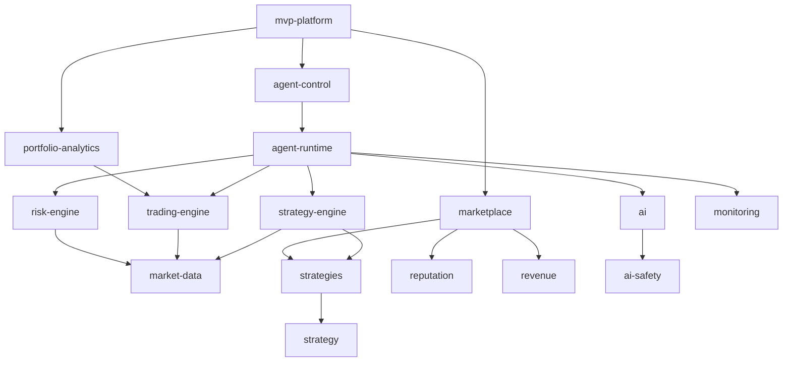

# TONAIAgent — Module Dependency Diagram

> Issue #241 · Deliverable 5 of 6

---

## Overview

This document maps the dependency relationships between the major modules in the TONAIAgent `src/` directory. Understanding these relationships is critical for:

- Planning module consolidation safely
- Identifying potential circular dependencies
- Onboarding new contributors
- Evaluating the impact radius of changes

---

## 1. High-Level Architecture Layers

The system is organized into logical layers, where higher layers depend on lower layers:

```
┌──────────────────────────────────────────────────────────────────┐
│  USER LAYER                                                      │
│  miniapp/  ·  telegram-miniapp/  ·  website/  ·  static-website/ │
└────────────────────────┬─────────────────────────────────────────┘
                         │
┌────────────────────────▼─────────────────────────────────────────┐
│  PRODUCT / MVP LAYER                                             │
│  mvp-platform  ·  mvp  ·  superapp  ·  production-miniapp        │
└────────────────────────┬─────────────────────────────────────────┘
                         │
┌────────────────────────▼─────────────────────────────────────────┐
│  APPLICATION LAYER                                               │
│  agent-runtime  ·  agent-orchestrator  ·  agent-control          │
│  marketplace  ·  strategy-marketplace  ·  strategy-engine        │
│  portfolio-analytics  ·  live-trading                            │
└────────────────────────┬─────────────────────────────────────────┘
                         │
┌────────────────────────▼─────────────────────────────────────────┐
│  DOMAIN LAYER                                                    │
│  strategies  ·  strategy  ·  trading-engine  ·  backtesting      │
│  reputation  ·  revenue  ·  growth  ·  risk-engine               │
│  monitoring  ·  distributed-scheduler                            │
└────────────────────────┬─────────────────────────────────────────┘
                         │
┌────────────────────────▼─────────────────────────────────────────┐
│  INFRASTRUCTURE LAYER                                            │
│  market-data  ·  portfolio  ·  ai  ·  ai-safety                  │
│  protocol  ·  security  ·  plugins  ·  runtime                   │
│  multi-agent  ·  multi-tenant                                    │
└──────────────────────────────────────────────────────────────────┘
```

---

## 2. Core Module Dependency Graph

### MVP Platform (Entry Point)

`mvp-platform` is the primary integration point that wires together all MVP core components:

```
mvp-platform
├── depends on: agent-control
│              └── depends on: agent-runtime
│                             ├── depends on: strategy-engine
│                             │              └── depends on: market-data
│                             ├── depends on: trading-engine
│                             ├── depends on: ai
│                             └── depends on: risk-engine
├── depends on: portfolio-analytics
│              └── depends on: trading-engine
│                             └── depends on: market-data
└── depends on: marketplace
               └── depends on: strategies
                              └── depends on: strategy
```

### Mermaid Diagram — MVP Core Dependencies



---

## 3. Module-by-Module Dependency Table

### Core Production Modules

| Module | Depends On | Depended On By |
|--------|-----------|----------------|
| `market-data` | (none — external APIs only) | `strategy-engine`, `trading-engine`, `risk-engine`, `backtesting`, `data-platform` |
| `ai` | `ai-safety` | `agent-runtime`, `strategy-engine` (AI Signal) |
| `ai-safety` | (none) | `ai` |
| `strategy` | (none) | `strategies`, `strategy-engine`, `strategy-marketplace` |
| `strategies` | `strategy` | `strategy-engine`, `marketplace` |
| `strategy-engine` | `strategy`, `strategies`, `market-data`, `ai` | `agent-runtime`, `backtesting`, `live-trading` |
| `trading-engine` | `market-data` | `agent-runtime`, `live-trading`, `portfolio-analytics`, `backtesting` |
| `live-trading` | `strategy-engine`, `trading-engine`, `market-data` | `agent-runtime` |
| `backtesting` | `strategy-engine`, `trading-engine`, `market-data` | (external use only) |
| `portfolio` | (none) | `portfolio-analytics`, `multi-user-portfolio` |
| `portfolio-analytics` | `portfolio`, `trading-engine` | `mvp-platform`, `agent-runtime` |
| `risk-engine` | `market-data` | `agent-runtime` |
| `reputation` | (none) | `marketplace`, `strategy-marketplace` |
| `revenue` | (none) | `marketplace` |
| `marketplace` | `strategies`, `reputation`, `revenue` | `mvp-platform`, `agent-runtime` |
| `strategy-marketplace` | `strategy`, `reputation` | `mvp-platform` |
| `agent-runtime` | `strategy-engine`, `trading-engine`, `ai`, `risk-engine`, `monitoring`, `portfolio-analytics` | `agent-orchestrator`, `agent-control`, `lifecycle-orchestrator` |
| `agent-orchestrator` | `agent-runtime` | `agent-control`, `mvp-platform` |
| `agent-control` | `agent-orchestrator`, `agent-runtime` | `mvp-platform` |
| `lifecycle-orchestrator` | `agent-runtime` | `mvp-platform` |
| `monitoring` | (none) | `agent-runtime`, `distributed-scheduler` |
| `distributed-scheduler` | `monitoring` | `agent-runtime` (optional) |
| `protocol` | `security` | `multi-agent`, `omnichain` |
| `security` | (none) | `protocol`, `agent-runtime`, `sdk` |
| `plugins` | (none) | `agent-runtime`, `sdk` |
| `runtime` | (none) | `agent-runtime`, `mvp-platform` |
| `multi-agent` | `protocol`, `security` | `agent-orchestrator` |
| `multi-tenant` | `security` | `agent-control` |
| `sdk` | `security`, `plugins` | (external developers) |
| `mvp` | `mvp-platform` | (entry point) |
| `mvp-platform` | `agent-control`, `portfolio-analytics`, `marketplace` | `superapp`, `production-miniapp` |
| `superapp` | `mvp-platform` | (user-facing entry) |
| `production-miniapp` | `mvp-platform` | (user-facing entry) |

---

### Extended Features Modules

| Module | Key Dependencies | Notes |
|--------|-----------------|-------|
| `omnichain` | `protocol`, `market-data` | Cross-chain bridge layer |
| `cross-chain-liquidity` | `omnichain`, `market-data`, `trading-engine` | Multi-chain arbitrage |
| `liquidity-network` | `market-data`, `trading-engine` | Institutional liquidity aggregation |
| `liquidity-router` | `market-data`, `strategy-engine` | Smart order routing |
| `clearing-house` | `trading-engine`, `protocol` | CCP clearing and netting |
| `prime-brokerage` | `portfolio-analytics`, `risk-engine` | Multi-fund custody |
| `hedgefund` | `strategy-engine`, `portfolio-analytics`, `risk-engine` | Autonomous fund |
| `fund-manager` | `hedgefund`, `portfolio-analytics` | Fund lifecycle |
| `ecosystem-fund` | `dao-governance`, `revenue` | Ecosystem grants |
| `investment` | `portfolio-analytics`, `risk-engine` | Investment framework |
| `institutional` | `security`, `protocol` | KYC/AML compliance |
| `institutional-network` | `institutional`, `liquidity-network` | Global partnerships |
| `rwa` | `protocol`, `institutional` | Real-world asset tokenization |
| `payments` | `trading-engine`, `protocol` | Autonomous payments |
| `growth` | `reputation`, `marketplace` | Viral growth, referrals |
| `dao-governance` | `protocol`, `security` | DAO mechanisms |
| `protocol-constitution` | `dao-governance` | Constitutional governance |
| `monetary-policy` | `tokenomics`, `market-data` | Monetary policy engine |

---

### Utilities and Support Modules

| Module | Key Dependencies | Notes |
|--------|-----------------|-------|
| `data-platform` | `market-data` | Extended data platform |
| `mobile-ux` | `mvp-platform` | Mobile UX abstractions |
| `personal-finance` | `portfolio-analytics`, `mvp-platform` | Personal wealth management |
| `no-code` | `strategy-engine`, `marketplace` | Visual strategy builder |
| `ai-credit` | `ai`, `risk-engine` | AI-powered lending |
| `autonomous-discovery` | `marketplace`, `ai` | Autonomous discovery |
| `ton-factory` | `protocol`, `security` | Smart contract factory |
| `launchpad` | `dao-governance`, `marketplace` | Agent launchpad |
| `token-strategy` | `tokenomics`, `market-data` | Token launch |
| `tokenomics` | (none) | Token economics |
| `token-utility-economy` | `tokenomics`, `marketplace` | Utility token mechanics |
| `regulatory` | `institutional`, `security` | Regulatory compliance |
| `sdacl` | `security` | Smart data access control |
| `ipls` | `liquidity-network`, `protocol` | Inter-Protocol Liquidity |
| `multi-user-portfolio` | `portfolio-analytics` | Multi-user portfolios |
| `systemic-risk` | `risk-engine`, `market-data` | Systemic risk monitoring |

---

## 4. Dependency Concentration Analysis

### Most Depended-Upon Modules (Highest Fan-In)

These modules are foundational — changes here have the widest blast radius:

| Rank | Module | Approximate Dependent Count | Risk Level |
|------|--------|------------------------------|------------|
| 1 | `market-data` | 10+ | 🔴 Critical |
| 2 | `strategy-engine` | 8+ | 🔴 Critical |
| 3 | `trading-engine` | 7+ | 🔴 Critical |
| 4 | `security` | 6+ | 🔴 Critical |
| 5 | `protocol` | 5+ | 🟠 High |
| 6 | `ai` | 5+ | 🟠 High |
| 7 | `portfolio-analytics` | 5+ | 🟠 High |
| 8 | `risk-engine` | 5+ | 🟠 High |
| 9 | `reputation` | 4+ | 🟡 Medium |
| 10 | `agent-runtime` | 4+ | 🟠 High |

### Leaf Modules (No Internal Dependencies)

These modules are safest to refactor independently:

- `market-data` (only external API calls)
- `ai-safety`
- `strategy` (base types)
- `portfolio` (base types)
- `tokenomics`
- `monitoring`
- `reputation`
- `revenue`
- `security`

---

## 5. Circular Dependency Risk Assessment

Based on the dependency graph, the following patterns represent circular dependency risks to watch for during consolidation:

### Risk Area 1: `strategy-engine` ↔ `ai`

`strategy-engine` calls `ai` for AI Signal strategy decisions. If `ai` ever needs to call back into `strategy-engine` for context, a circular dependency forms.

**Mitigation**: Keep `ai` as a stateless inference module; pass context as parameters rather than importing `strategy-engine`.

### Risk Area 2: `marketplace` ↔ `revenue` ↔ `strategies`

`marketplace` depends on `revenue` for fee calculation. `revenue` may reference marketplace data for distribution. `strategies` are published to `marketplace`.

**Mitigation**: Extract shared `types.ts` for marketplace/strategy interfaces; avoid runtime cross-imports.

### Risk Area 3: `agent-runtime` ↔ `monitoring`

`agent-runtime` emits metrics to `monitoring`. If `monitoring` needs to call agent APIs to get more context, a circular dependency forms.

**Mitigation**: Use an event bus / observer pattern; `agent-runtime` emits events; `monitoring` subscribes.

---

## 6. Recommended Consolidation Groups

Based on dependency analysis, the following modules should be consolidated together (they form tightly-coupled clusters):

### Group A: Agent Core
```
agents + agent-runtime + agent-orchestrator + agent-control + lifecycle-orchestrator
→ src/agent-core/ (with internal subdirectories)
```
All 5 modules share a single execution concern and have sequential dependencies.

### Group B: Strategy Core
```
strategy + strategies + strategy-engine + strategy-marketplace + backtesting
→ src/strategy-core/ (with internal subdirectories)
```
All share the strategy type system and execution pipeline.

### Group C: Trading Core
```
trading + trading-engine + live-trading
→ src/trading-engine/ (expanded)
```
`trading` provides utilities consumed by `trading-engine`; `live-trading` wraps `trading-engine` for production.

### Group D: Portfolio Core
```
portfolio + portfolio-analytics + multi-user-portfolio
→ src/portfolio-analytics/ (expanded)
```
`portfolio` provides base types; `portfolio-analytics` is the primary module; `multi-user-portfolio` extends it.

### Group E: AI Core
```
ai + ai-safety
→ src/ai/ (with safety/ subdir)
```
`ai-safety` is a submodule of `ai` — they share no overlapping concerns but `ai` always depends on `ai-safety`.

### Group F: Market Data Core
```
market-data + data-platform
→ src/market-data/ (expanded)
```
`data-platform` extends `market-data` with additional signal sources.

---

## 7. Data Flow Summary

The primary production data flow through the system:

```
External Market APIs (CoinGecko, Binance, DEX)
            ↓
        market-data
      (cache + normalize)
            ↓
      strategy-engine
    (generate trade signal)
            ↓
        risk-engine
    (validate within limits)
            ↓
       trading-engine
    (simulate/execute trade)
            ↓
     portfolio-analytics
     (track PnL, metrics)
            ↓
       agent-runtime
    (record + emit events)
            ↓
        monitoring
    (health + alerting)
            ↓
     portfolio-analytics
    (update dashboard data)
            ↓
       mvp-platform
    (expose to Mini App UI)
```

---

*See also: [architecture-audit.md](architecture-audit.md), [restructuring-plan.md](restructuring-plan.md), [refactoring-roadmap.md](refactoring-roadmap.md)*
