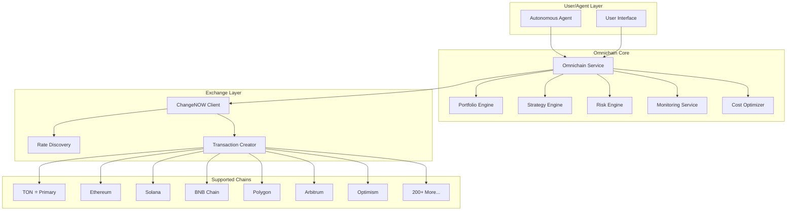

# Omnichain Agent Infrastructure

Comprehensive cross-chain infrastructure enabling autonomous agents to operate across multiple blockchains while maintaining a TON-first execution environment on The Open Network.

## Overview

The Omnichain module enables agents to:
- Move capital across 200+ blockchains
- Execute arbitrage and yield rotation strategies
- Hedge exposure and diversify portfolios
- Access global DeFi opportunities
- Maintain unified portfolio control

## Architecture



## Key Components

### 1. ChangeNOW Integration

API client for executing swaps across 200+ chains and 1,200+ assets.

```typescript
import { createChangeNowClient } from '@tonaiagent/core/omnichain';

const exchange = createChangeNowClient({
  apiKey: process.env.CHANGENOW_API_KEY,
  apiVersion: 'v1',
  rateLimitPerSecond: 30,
});

// Get available currencies
const currencies = await exchange.getCurrencies();

// Get rate estimate
const estimate = await exchange.getEstimate('ton', 'eth', '100');

// Create exchange transaction
const transaction = await exchange.createExchange({
  fromCurrency: 'ton',
  toCurrency: 'eth',
  fromAmount: '100',
  address: '0x...',
});
```

### 2. Portfolio Engine

Unified portfolio management across all chains.

```typescript
import { createPortfolioEngine } from '@tonaiagent/core/omnichain';

const portfolio = createPortfolioEngine({
  syncIntervalMinutes: 5,
  enableRealtimeUpdates: true,
});

// Get cross-chain portfolio
const result = await portfolio.getPortfolio('user_123');
console.log(`Total Value: $${result.data.totalValueUsd}`);
console.log(`Chain Allocations:`, result.data.chainAllocations);

// Get exposure metrics
const exposure = await portfolio.getExposure('user_123');
console.log(`Stablecoin %: ${exposure.data.stablecoinPercent}`);
console.log(`Largest Position %: ${exposure.data.largestPositionPercent}`);

// Get risk metrics
const risk = await portfolio.getRiskMetrics('user_123');
console.log(`Risk Score: ${risk.data.overallRiskScore}/10`);
console.log(`VaR (95%): $${risk.data.valueAtRisk95}`);
```

### 3. Strategy Engine

Cross-chain strategy creation and execution.

```typescript
import { createCrossChainStrategyEngine } from '@tonaiagent/core/omnichain';

const strategy = createCrossChainStrategyEngine({
  maxActiveStrategies: 10,
  emergencyPauseEnabled: true,
});

// Create arbitrage strategy
const arb = await strategy.createStrategy({
  name: 'TON-ETH Arbitrage',
  description: 'Detect and execute arbitrage opportunities',
  type: 'arbitrage',
  userId: 'user_123',
  agentId: 'agent_456',
  allowedChains: ['ton', 'eth'],
  allowedAssets: ['ton', 'eth', 'usdt'],
  config: {
    triggerConditions: [{
      id: 'price-diff',
      type: 'price_threshold',
      condition: { operator: 'gt', value: 1 },
      parameters: { minProfitPercent: 1 },
      priority: 1,
    }],
    actions: [{
      id: 'execute-swap',
      type: 'swap',
      parameters: { autoExecute: true },
      priority: 1,
    }],
    checkIntervalMinutes: 1,
    maxConcurrentExecutions: 1,
    cooldownMinutes: 5,
  },
  capitalAllocation: {
    maxTotalCapitalPercent: 30,
    maxPerChainPercent: 20,
    reserveCapitalPercent: 30,
  },
  riskParameters: {
    maxSlippagePercent: 0.5,
    maxSingleLossPercent: 2,
    maxDrawdownPercent: 5,
  },
});

// Activate strategy
await strategy.activateStrategy(arb.data.id);

// Check triggers
const triggers = await strategy.checkTriggers(arb.data.id);
if (triggers.data.triggers.length > 0) {
  console.log('Strategy triggered!', triggers.data.actions);
}
```

### 4. Risk Engine

Comprehensive risk assessment and policy enforcement.

```typescript
import { createRiskEngine } from '@tonaiagent/core/omnichain';

const risk = createRiskEngine({
  maxRiskScoreAllowed: 7,
  requireApprovalAbove: 5,
});

// Get chain risk profile
const ethRisk = await risk.getChainRiskProfile('eth');
console.log(`ETH Risk Score: ${ethRisk.data.overallRiskScore}`);

// Assess transaction risk
const assessment = await risk.assessTransaction({
  type: 'swap',
  agentId: 'agent_123',
  userId: 'user_456',
  sourceChain: 'ton',
  destinationChain: 'eth',
  sourceAssetId: 'ton',
  destinationAssetId: 'eth',
  sourceAmount: '1000',
  destinationAddress: '0x...',
});

console.log(`Risk Level: ${assessment.data.riskLevel}`);
console.log(`Recommendation: ${assessment.data.recommendation}`);

// Create security policy
await risk.createPolicy({
  name: 'Conservative Policy',
  enabled: true,
  chainWhitelist: ['ton', 'eth'],
  assetWhitelist: ['ton', 'eth', 'usdt', 'usdc'],
  maxTransactionValue: 10000,
  maxDailyVolume: 50000,
  requireMultiSigAbove: 5000,
  emergencyHaltEnabled: true,
  rules: [],
});

// Emergency halt
await risk.emergencyHalt('Suspicious activity detected');
```

### 5. Monitoring Service

Real-time observability and alerting.

```typescript
import { createMonitoringService } from '@tonaiagent/core/omnichain';

const monitoring = createMonitoringService({
  logLevel: 'info',
  alertsEnabled: true,
  eventRetentionDays: 30,
});

// Log execution step
const logId = monitoring.startExecution('tx_123', 'exchange_creation');
// ... do work ...
monitoring.completeExecution(logId, true, { exchangeId: 'cn_456' });

// Track transaction status
monitoring.trackTransaction('tx_123', 'completed', {
  amount: '100',
  fee: '1.5',
});

// Get dashboard data
const dashboard = await monitoring.getDashboardData();
console.log(`24h Transactions: ${dashboard.data.summary.totalTransactions24h}`);
console.log(`Success Rate: ${dashboard.data.summary.successRate24h}%`);

// Create alert
await monitoring.createAlert({
  severity: 'warning',
  category: 'slippage',
  title: 'High Slippage Detected',
  message: 'Slippage exceeded 2% on recent transaction',
  transactionId: 'tx_123',
});

// Subscribe to events
monitoring.onEvent((event) => {
  console.log(`[${event.severity}] ${event.message}`);
});
```

### 6. Cost Optimizer

Intelligent routing and fee optimization.

```typescript
import { createCostOptimizer } from '@tonaiagent/core/omnichain';

const optimizer = createCostOptimizer({
  optimizeGas: true,
  optimizeRouting: true,
  batchTransactions: true,
});

// Find optimal route
const routes = await optimizer.findOptimalRoute({
  sourceChain: 'ton',
  destinationChain: 'eth',
  sourceAsset: 'ton',
  destinationAsset: 'eth',
  amount: '100',
  priority: 'normal',
});

console.log('Best Route:', routes.data[0]);

// Compare routes
const comparison = optimizer.compareRoutes(routes.data);
console.log(`Savings vs worst: ${comparison.savingsVsWorst}%`);

// Get gas estimate
const gas = await optimizer.estimateGas({
  chainId: 'eth',
  transactionType: 'swap',
  priority: 'normal',
});
console.log(`Estimated Gas Cost: $${gas.data.totalCostUsd}`);

// Batch transactions
const batch = await optimizer.createBatch(['tx_1', 'tx_2', 'tx_3']);
const result = await optimizer.processBatch(batch.data.id);
console.log(`Batch Savings: $${result.data.totalSavingsUsd}`);

// Forecast fees
const forecast = await optimizer.forecastFees('ton', 'eth', 24);
forecast.data.forEach((f) => {
  console.log(`${f.period}: $${f.estimatedFeeUsd} (${f.trend})`);
});
```

## Strategy Templates

Pre-built templates for common cross-chain strategies:

| Template | Type | Description | Difficulty |
|----------|------|-------------|------------|
| Cross-Chain Arbitrage | `arbitrage` | Detect and execute arbitrage opportunities | Advanced |
| Yield Rotation | `yield_rotation` | Rotate capital to highest-yielding opportunities | Intermediate |
| Stablecoin Diversification | `stablecoin_diversification` | Maintain diversified stablecoin portfolio | Beginner |
| Cross-Chain Hedging | `hedging` | Hedge volatile asset exposure | Intermediate |
| Multi-Chain DCA | `dca` | Dollar cost average across chains | Beginner |

```typescript
// Get available templates
const templates = strategy.getTemplates();

// Create strategy from template
const myStrategy = await strategy.createFromTemplate(
  'arbitrage-basic',
  'user_123',
  'agent_456'
);
```

## Supported Chains

Initial chain support (expandable via ChangeNOW):

| Chain | ID | Type | Risk Score |
|-------|-----|------|------------|
| **TON** ⭐ | `ton` | TON | 3/10 |
| Ethereum | `eth` | EVM | 2/10 |
| Solana | `sol` | Solana | 3/10 |
| BNB Chain | `bnb` | EVM | 3/10 |
| Polygon | `polygon` | EVM | 3/10 |
| Arbitrum | `arbitrum` | EVM L2 | 3/10 |
| Optimism | `optimism` | EVM L2 | 3/10 |
| Avalanche | `avalanche` | EVM | 4/10 |
| Fantom | `fantom` | EVM | 4/10 |
| Cosmos | `cosmos` | Cosmos | 4/10 |

## Configuration

```typescript
import { createOmnichainService, OmnichainConfig } from '@tonaiagent/core/omnichain';

const config: Partial<OmnichainConfig> = {
  enabled: true,
  primaryChain: 'ton',
  supportedChains: ['ton', 'eth', 'sol', 'bnb', 'polygon', 'arbitrum', 'optimism'],

  changeNow: {
    apiKey: process.env.CHANGENOW_API_KEY,
    apiVersion: 'v1',
    baseUrl: 'https://api.changenow.io',
    timeoutMs: 30000,
    retryAttempts: 3,
    rateLimitPerSecond: 30,
  },

  portfolio: {
    syncIntervalMinutes: 5,
    staleThresholdMinutes: 15,
    enableRealtimeUpdates: true,
    trackHistoricalData: true,
    retentionDays: 90,
  },

  strategy: {
    maxActiveStrategies: 10,
    defaultCheckIntervalMinutes: 5,
    maxConcurrentExecutions: 3,
    emergencyPauseEnabled: true,
  },

  risk: {
    enabled: true,
    maxRiskScoreAllowed: 7,
    requireApprovalAbove: 5,
    concentrationLimits: {
      maxPerChain: 50,
      maxPerAsset: 30,
      maxVolatileAssets: 70,
      minStablecoinReserve: 10,
    },
  },

  monitoring: {
    enabled: true,
    logLevel: 'info',
    metricsEnabled: true,
    alertsEnabled: true,
    eventRetentionDays: 30,
  },

  costOptimization: {
    enabled: true,
    optimizeGas: true,
    optimizeRouting: true,
    batchTransactions: true,
  },
};

const omnichain = createOmnichainService(config);
```

## Health Monitoring

```typescript
// Check system health
const health = await omnichain.getHealth();

console.log(`Overall: ${health.overall}`);
console.log('Components:', health.components);
console.log('Chain Status:', health.chainStatus);

// Example output:
// Overall: healthy
// Components: { exchange: true, portfolio: true, strategy: true, risk: true, monitoring: true, costOptimizer: true }
// Chain Status: { ton: 'operational', eth: 'operational', sol: 'operational', ... }
```

## Security Considerations

1. **Chain Whitelists** - Only allow approved chains
2. **Asset Whitelists** - Restrict tradeable assets
3. **Transaction Limits** - Enforce value caps
4. **Multi-sig Requirements** - Require approvals for large transactions
5. **Emergency Halt** - Instant shutdown capability
6. **Risk Assessment** - Automatic risk scoring for all transactions
7. **Slippage Protection** - Maximum slippage enforcement
8. **Rate Limiting** - API rate limit compliance

## API Reference

### OmnichainService

| Method | Description |
|--------|-------------|
| `getHealth()` | Get system health status |
| `onEvent(callback)` | Subscribe to events |

### ChangeNowClient

| Method | Description |
|--------|-------------|
| `getCurrencies()` | List available currencies |
| `getCurrency(ticker)` | Get currency details |
| `getMinAmount(from, to)` | Get minimum exchange amount |
| `getEstimate(from, to, amount)` | Get rate estimate |
| `createExchange(request)` | Create exchange transaction |
| `getTransaction(id)` | Get transaction status |
| `checkHealth()` | Check API health |

### PortfolioEngine

| Method | Description |
|--------|-------------|
| `getPortfolio(userId)` | Get user portfolio |
| `syncPortfolio(userId)` | Sync portfolio balances |
| `getHoldings(userId, chainId?)` | Get holdings |
| `getChainAllocations(userId)` | Get chain allocations |
| `getExposure(userId)` | Get exposure metrics |
| `getRiskMetrics(userId)` | Get risk metrics |
| `getTotalValue(userId)` | Get total value |
| `getHistoricalValue(userId, period)` | Get historical values |

### CrossChainStrategyEngine

| Method | Description |
|--------|-------------|
| `createStrategy(input)` | Create new strategy |
| `getStrategy(id)` | Get strategy details |
| `updateStrategy(id, updates)` | Update strategy |
| `deleteStrategy(id)` | Delete strategy |
| `activateStrategy(id)` | Activate strategy |
| `pauseStrategy(id)` | Pause strategy |
| `stopStrategy(id)` | Stop strategy |
| `listStrategies(userId, filter?)` | List strategies |
| `checkTriggers(id)` | Check trigger conditions |
| `simulateTrigger(id, triggerId)` | Simulate trigger |
| `getPerformance(id, period?)` | Get performance metrics |
| `getTemplates()` | Get strategy templates |
| `createFromTemplate(templateId, userId, agentId)` | Create from template |

### RiskEngine

| Method | Description |
|--------|-------------|
| `getChainRiskProfile(chainId)` | Get chain risk profile |
| `updateChainRiskProfile(chainId, updates)` | Update chain risk |
| `assessTransaction(request)` | Assess transaction risk |
| `createPolicy(policy)` | Create security policy |
| `getPolicy(id)` | Get policy |
| `updatePolicy(id, updates)` | Update policy |
| `evaluatePolicy(transaction, policyId?)` | Evaluate against policy |
| `calculateSlippageRisk(...)` | Calculate slippage risk |
| `emergencyHalt(reason, scope?)` | Halt operations |
| `resumeOperations(scope?)` | Resume operations |
| `getRiskAlerts(filters?)` | Get risk alerts |

### MonitoringService

| Method | Description |
|--------|-------------|
| `logEvent(event)` | Log event |
| `getEvents(filters?)` | Get events |
| `startExecution(txId, step)` | Start execution log |
| `completeExecution(logId, success, details?)` | Complete execution log |
| `getExecutionLogs(txId)` | Get execution logs |
| `recordMetric(name, value, tags?)` | Record metric |
| `getMetrics()` | Get metrics |
| `trackTransaction(id, status, metadata?)` | Track transaction |
| `getTransactionHistory(filters?)` | Get transaction history |
| `createAlert(input)` | Create alert |
| `getAlerts(filters?)` | Get alerts |
| `getDashboardData()` | Get dashboard data |

### CostOptimizer

| Method | Description |
|--------|-------------|
| `findOptimalRoute(request)` | Find optimal route |
| `compareRoutes(routes)` | Compare routes |
| `estimateGas(request)` | Estimate gas |
| `getGasPrice(chainId)` | Get gas price |
| `findOptimalGasPrice(chainId)` | Find optimal gas price |
| `createBatch(transactions)` | Create transaction batch |
| `processBatch(batchId)` | Process batch |
| `forecastFees(source, dest, periods)` | Forecast fees |
| `analyzeCosts(transactionId)` | Analyze transaction costs |

## Event Types

| Event | Description |
|-------|-------------|
| `transaction_created` | New transaction created |
| `transaction_pending` | Transaction pending |
| `transaction_confirming` | Transaction confirming |
| `transaction_completed` | Transaction completed |
| `transaction_failed` | Transaction failed |
| `strategy_triggered` | Strategy trigger activated |
| `strategy_executed` | Strategy action executed |
| `portfolio_synced` | Portfolio synchronized |
| `risk_alert` | Risk alert generated |
| `rate_alert` | Rate/price alert |
| `emergency_halt` | Emergency halt activated |

## Best Practices

1. **Start with templates** - Use pre-built strategy templates as starting points
2. **Test with small amounts** - Always test strategies with minimal capital first
3. **Set conservative limits** - Start with tight risk parameters and adjust
4. **Monitor actively** - Use the monitoring service to track all operations
5. **Use batching** - Batch similar transactions for cost savings
6. **Diversify chains** - Don't concentrate too much capital on one chain
7. **Keep reserves** - Always maintain stablecoin reserves for emergencies
8. **Review alerts** - Don't ignore risk alerts from the system

## Error Handling

All methods return `ActionResult<T>` with consistent error handling:

```typescript
const result = await omnichain.exchange.getEstimate('ton', 'eth', '100');

if (!result.success) {
  console.error(`Error: ${result.error?.message}`);
  console.error(`Code: ${result.error?.code}`);
  console.error(`Retryable: ${result.error?.retryable}`);
} else {
  console.log('Estimate:', result.data);
}
```

### Error Codes

| Code | Description |
|------|-------------|
| `INVALID_CHAIN` | Invalid or unsupported chain |
| `INVALID_ASSET` | Invalid or unsupported asset |
| `INSUFFICIENT_BALANCE` | Insufficient balance |
| `INSUFFICIENT_LIQUIDITY` | Insufficient liquidity |
| `RATE_EXPIRED` | Exchange rate expired |
| `TRANSACTION_FAILED` | Transaction execution failed |
| `EXCHANGE_FAILED` | Exchange creation failed |
| `TIMEOUT` | Operation timed out |
| `API_ERROR` | External API error |
| `RISK_LIMIT_EXCEEDED` | Risk limits exceeded |
| `POLICY_VIOLATION` | Security policy violation |
| `APPROVAL_REQUIRED` | Human approval required |
| `EMERGENCY_HALT` | System halted |
| `CHAIN_UNAVAILABLE` | Chain temporarily unavailable |
